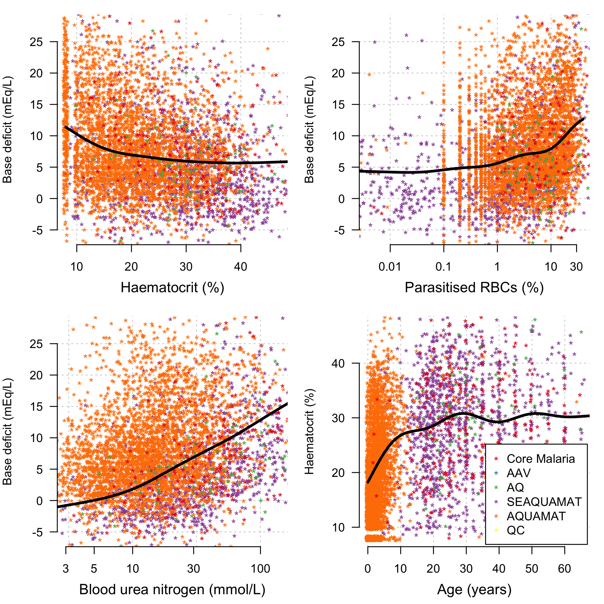
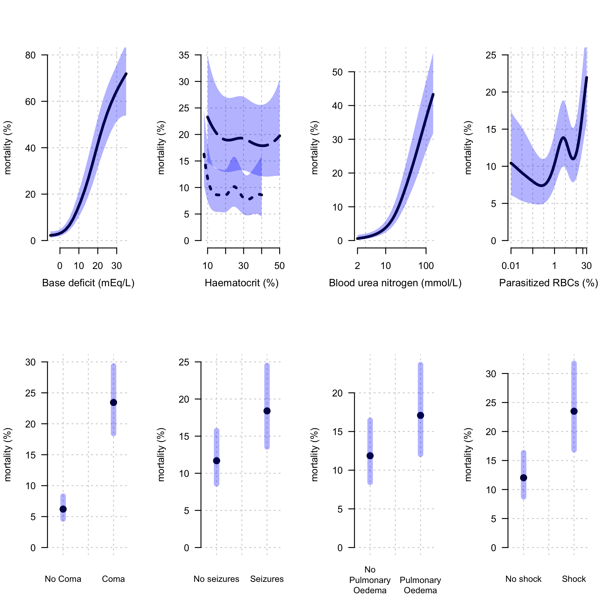

# Preliminaries


# Exploratory analysis


This looks at the severe malaria legacy dataset from MORU.


First we look at the mortality rates across the different studies.


```
## [1] "Core Malaria , mortality of: 22 %"
## [1] "AAV , mortality of: 10 %"
## [1] "SEAQUAMAT , mortality of: 19 %"
## [1] "AQUAMAT , mortality of: 10 %"
## [1] "AQ , mortality of: 15 %"
```

We look at the quantiles of the ages in the different studies:

```
## [1] "Core Malaria, ages:1 Core Malaria, ages:26 Core Malaria, ages:80"
## [1] "AAV, ages:15 AAV, ages:32 AAV, ages:77"
## [1] "SEAQUAMAT, ages:2 SEAQUAMAT, ages:25 SEAQUAMAT, ages:87"
## [1] "AQUAMAT, ages:0 AQUAMAT, ages:2 AQUAMAT, ages:78"
## [1] "AQ, ages:15 AQ, ages:30 AQ, ages:79"
```

```
## [1] "Core Malaria"
## 
##  Amodiaquine   Artemether   Artesunate  Chloroquine Lumefantrine 
##           10           11          461            4            1 
##   Mefloquine          NAC      Quinine 
##           10            6          613 
## [1] "AAV"
## 
##  Amodiaquine   Artemether   Artesunate  Chloroquine Lumefantrine 
##            0          184          186            0            0 
##   Mefloquine          NAC      Quinine 
##            0            0            0 
## [1] "SEAQUAMAT"
## 
##  Amodiaquine   Artemether   Artesunate  Chloroquine Lumefantrine 
##            0            0          730            0            0 
##   Mefloquine          NAC      Quinine 
##            0            0          731 
## [1] "AQUAMAT"
## 
##  Amodiaquine   Artemether   Artesunate  Chloroquine Lumefantrine 
##            0            0         2746            0            0 
##   Mefloquine          NAC      Quinine 
##            0            0         2748 
## [1] "AQ"
## 
##  Amodiaquine   Artemether   Artesunate  Chloroquine Lumefantrine 
##            0          284            0            0            0 
##   Mefloquine          NAC      Quinine 
##            0            0          276
```


Let's look at the linear associations between the key baseline variables. We use mixed effects linear models to estimate these associations (random effect terms for both country and study).


```
## 
## Family: gaussian 
## Link function: identity 
## 
## Formula:
## BD ~ s(log10(BUN)) + s(studyID, bs = "re") + s(country, bs = "re")
## 
## Parametric coefficients:
##             Estimate Std. Error t value Pr(>|t|)  
## (Intercept)    4.627      1.946   2.377   0.0175 *
## ---
## Signif. codes:  0 '***' 0.001 '**' 0.01 '*' 0.05 '.' 0.1 ' ' 1
## 
## Approximate significance of smooth terms:
##                  edf Ref.df       F  p-value    
## s(log10(BUN))  4.156  5.146  254.60  < 2e-16 ***
## s(studyID)     2.787  3.000 2650.74 1.02e-13 ***
## s(country)    11.352 14.000   31.72   0.0107 *  
## ---
## Signif. codes:  0 '***' 0.001 '**' 0.01 '*' 0.05 '.' 0.1 ' ' 1
## 
## R-sq.(adj) =  0.284   Deviance explained = 28.7%
## GCV = 38.562  Scale est. = 38.422    n = 5298
```

```
## 
## Family: gaussian 
## Link function: identity 
## 
## Formula:
## HCT ~ s(AgeInYear) + s(studyID, bs = "re") + s(country, bs = "re")
## 
## Parametric coefficients:
##             Estimate Std. Error t value Pr(>|t|)    
## (Intercept)  23.7629     0.9015   26.36   <2e-16 ***
## ---
## Signif. codes:  0 '***' 0.001 '**' 0.01 '*' 0.05 '.' 0.1 ' ' 1
## 
## Approximate significance of smooth terms:
##                 edf Ref.df     F  p-value    
## s(AgeInYear)  7.503  8.318 42.53  < 2e-16 ***
## s(studyID)    1.376  3.000 14.03   0.0457 *  
## s(country)   12.522 14.000 11.14 4.19e-10 ***
## ---
## Signif. codes:  0 '***' 0.001 '**' 0.01 '*' 0.05 '.' 0.1 ' ' 1
## 
## R-sq.(adj) =  0.257   Deviance explained =   26%
## GCV = 70.157  Scale est. = 69.86     n = 5298
```

<!-- -->

Effect on survival 


```r
modHCT=gam(outcome ~ s(HCT) + s(studyID, bs='re') + s(country, bs='re'),
           data = Leg_data_complete, family='binomial')

modcoma=gam(outcome ~ coma + s(studyID, bs='re') + s(country, bs='re'),
            data = Leg_data_complete, family='binomial')

modBD=gam(outcome ~ s(BD) + s(studyID, bs='re') + s(country, bs='re'),
          data = Leg_data_complete, family='binomial')

modpoedema=gam(outcome ~ poedema + s(studyID, bs='re') + s(country, bs='re'),
               data = Leg_data_complete, family='binomial')

modconv=gam(outcome ~ convulsions + s(studyID, bs='re') + s(country, bs='re'),
            data = Leg_data_complete, family='binomial')

modBUN=gam(outcome ~ s(log10(BUN)) + s(studyID, bs='re') + s(country, bs='re'),
           data = Leg_data_complete, family='binomial')
```

<!-- -->

# Sensitivity Analysis

## Only using complete records


```r
vars_interest = c('outcome','HCT','LPAR_pct','coma','convulsions','poedema',
                  'BUN','BD','shock','hypoglycaemia',
                  'studyID','country')
complete_cases = apply(m[,vars_interest], 1, function(x) sum(is.na(x))) == 0
Complete_Leg_data = m[complete_cases,] 
Complete_Leg_data$studyID = as.factor(as.character(Complete_Leg_data$studyID))
```


```r
DAG_fmla = "outcome ~ HCT + LPAR_pct + coma + convulsions + poedema + 
              log2(BUN) + BD + shock + hypoglycaemia + 
              drug_AS + (1 | studyID) + (1 | country)"
# fit the model to each dataset
mod1 = glmer(formula = DAG_fmla, data = Complete_Leg_data, 
             family=binomial) 
summary(mod1)
```

```
## Generalized linear mixed model fit by maximum likelihood (Laplace
##   Approximation) [glmerMod]
##  Family: binomial  ( logit )
## Formula: 
## outcome ~ HCT + LPAR_pct + coma + convulsions + poedema + log2(BUN) +  
##     BD + shock + hypoglycaemia + drug_AS + (1 | studyID) + (1 |  
##     country)
##    Data: Complete_Leg_data
## 
##      AIC      BIC   logLik deviance df.resid 
##   2857.9   2943.4  -1416.0   2831.9     5268 
## 
## Scaled residuals: 
##     Min      1Q  Median      3Q     Max 
## -2.3834 -0.3113 -0.1765 -0.1034 17.7135 
## 
## Random effects:
##  Groups  Name        Variance Std.Dev.
##  country (Intercept) 0.22871  0.4782  
##  studyID (Intercept) 0.01197  0.1094  
## Number of obs: 5281, groups:  country, 15; studyID, 4
## 
## Fixed effects:
##                Estimate Std. Error z value Pr(>|z|)    
## (Intercept)   -6.913951   0.357444 -19.343  < 2e-16 ***
## HCT            0.012481   0.005808   2.149 0.031631 *  
## LPAR_pct      -0.015357   0.066143  -0.232 0.816401    
## coma           1.305195   0.109830  11.884  < 2e-16 ***
## convulsions1   0.495719   0.122658   4.041 5.31e-05 ***
## poedema1       1.064592   0.535644   1.987 0.046867 *  
## log2(BUN)      0.610245   0.053666  11.371  < 2e-16 ***
## BD             0.105487   0.007824  13.483  < 2e-16 ***
## shock1        -0.162353   0.204148  -0.795 0.426455    
## hypoglycaemia  0.554367   0.155050   3.575 0.000350 ***
## drug_AS       -0.386307   0.099777  -3.872 0.000108 ***
## ---
## Signif. codes:  0 '***' 0.001 '**' 0.01 '*' 0.05 '.' 0.1 ' ' 1
## 
## Correlation of Fixed Effects:
##             (Intr) HCT    LPAR_p coma   cnvls1 poedm1 l2(BUN BD     shock1
## HCT         -0.467                                                        
## LPAR_pct     0.025  0.006                                                 
## coma        -0.130 -0.056  0.044                                          
## convulsins1 -0.100 -0.083  0.025 -0.245                                   
## poedema1     0.040 -0.061  0.045 -0.013  0.041                            
## log2(BUN)   -0.707  0.041 -0.088  0.005  0.111 -0.032                     
## BD          -0.076  0.180 -0.150 -0.036  0.024  0.027 -0.275              
## shock1      -0.017 -0.009 -0.052  0.014 -0.022 -0.036  0.013 -0.135       
## hypoglycaem -0.002  0.017 -0.025 -0.047  0.070  0.011  0.017 -0.239 -0.008
## drug_AS     -0.060 -0.015  0.002 -0.027  0.022  0.032 -0.063 -0.013 -0.021
##             hypgly
## HCT               
## LPAR_pct          
## coma              
## convulsins1       
## poedema1          
## log2(BUN)         
## BD                
## shock1            
## hypoglycaem       
## drug_AS     -0.006
```


```r
# The scalar multiples to put the AORs on the correct scales
# Compute 95% CIs
FixedEffs = as.data.frame(summary(mod1)$coefficients)
FixedEffs$Scalar_f = c(1,10, 1, 1, 1, 1,log2(3), 10, 1, 1,1)
Results = data.frame(lowerCI = exp(FixedEffs$Scalar_f*(FixedEffs$Estimate -
                                                         1.96*FixedEffs$`Std. Error`)),
                     mean = exp(FixedEffs$Scalar_f*(FixedEffs$Estimate)),
                     upperCI = exp(FixedEffs$Scalar_f*(FixedEffs$Estimate +
                                                         1.96*FixedEffs$`Std. Error`)))
rownames(Results) = rownames(FixedEffs)
```

Make the 'forest' plot:

```r
plotting_ind = rownames(Results) %in% c('BD','coma','convulsions1',
                                        'drug_AS','HCT','log2(BUN)','poedema1')
Results = Results[plotting_ind,]
Results$Y_Labels = c('-10 % points\nabsolute haematocrit\non admission',
                     'Coma\non admission',
                     'Seizures\non admission',
                     'Pulmonary\nOedema\non admission',
                     '3 fold increase\nin blood urea\nnitrogen (mmol/L)',
                     '+10 mEq/L\nbase deficit',
                     'Artemisinin drug\nversus\nnon Artemisinin drug'
)


x_ind = sort.int(Results$mean, index.return = T)$ix
Results = Results[x_ind,]
par(bty='n', las=1, mar = c(3,9,2,2))

xlims = c(0.5, 8.5)
plot(NA,NA, xlim= log2(xlims), ylim = c(0,1),xaxt='n',
     xlab='', ylab='', yaxt='n')
axis(1, at = log2(c(0.5,1, 2,4)), labels = c(0.5,1, 2,4))
abline(v=0, lty=2, lwd=3, col='red')
yindex =1
ypos = seq(0,1,length.out = sum(plotting_ind))

Results['HCT',1:3] = 1/Results['HCT',1:3]
for(i in 1:nrow(Results)){
  arrows(log2(Results[i,'lowerCI']),ypos[yindex],
         log2(Results[i,'upperCI']),ypos[yindex],
         length=0.05, angle=90, code=3, 
         col = 'black',lwd=3)
  points(log2(Results[i,'mean']),ypos[yindex],pch=18,cex=2)
  yindex=yindex+1
  
}
abline(h=ypos, lty=3)
axis(side = 2, at = ypos, labels = Results$Y_Labels,tick=FALSE)
mtext(side=1, line = 2, text = 'Adjusted odds ratio')
mtext(side = 3, line = 1, text = 'Increased survival',adj = 0)
mtext(side = 3, line = 1, text = 'Decreased survival',adj = 1)
```

<!-- -->


## The effect of Transfusion

We stratify by time to death.

Some data adjustments: need to do this elsewhere


Select the patients who survive past 4 hours

```r
#### We're just looking at the those who didn't die before 4 hours post admission
m$Outcome4hours = 0
m$Outcome4hours[!is.na(m$Timetodeathhrs) & m$Timetodeathhrs < 4] = 1

# We only look at individuals who survive past 4 hours
m = filter(m, Outcome4hours==0)
```

```
## Warning: package 'bindrcpp' was built under R version 3.4.4
```


Multiple Imputation:

```r
###----- Do the imputation ---
# Base deficit from bicarbonate
BD_and_bicarbonate = !is.na(m$BD) & !is.na(m$bicarbonate)
mod_impute1 = lmer(BD ~ bicarbonate + (1 | studyID) + (1 | country), 
                   data= m[BD_and_bicarbonate,])
# Base deficit and lactate
BD_and_lactate = !is.na(m$BD) & !is.na(m$lactate)
mod_impute2 = lmer(BD ~ lactate + (1 | country), 
                   data= m[BD_and_lactate,])
# Base deficit and rr
BD_and_rr = !is.na(m$BD) & !is.na(m$rr)
mod_impute3 = lmer(BD ~ rr + (1 | studyID) + (1 | country), 
                   data= m[BD_and_rr,])

ind1 = is.na(m$BD) & !is.na(m$bicarbonate)
ind2 = !ind1 & is.na(m$BD) & !is.na(m$lactate)
ind3 = !ind1 & !ind2 & is.na(m$BD) & !is.na(m$rr)

# BUN and creatinine
BUN_and_cr = !is.na(m$BUN) & !is.na(m$creatinine)
mod_impute4 = lmer(log(BUN) ~ creatinine + (1 | studyID) + (1 | country), 
                   data= m[BUN_and_cr,])
ind4 = is.na(m$BUN) & !is.na(m$creatinine)

# Age from HCT
HCT_and_Age = !is.na(m$AgeInYear) & !is.na(m$HCT)
mod_impute5 = lmer(HCT ~ AgeInYear + (1 | studyID) + (1 | country),
                   data = m[HCT_and_Age,])
ind5 = is.na(m$HCT) & !is.na(m$AgeInYear)

# marginal distribution of BD to impute remaining
BD_alone = !is.na(m$BD)
mod_impute6 = lmer(BD ~ AgeInYear + (1 | studyID) + (1 | country),
                   data = m[BD_alone,])
ind6 = !ind1 & !ind2 & !ind3 & is.na(m$BD)

# marginal distribution of coma 
Coma_alone = !is.na(m$coma)
mod_impute7 = glmer(coma ~ AgeInYear + hypoglycaemia + (1 | studyID) + (1 | country),
                    family = 'binomial',
                    data = m[Coma_alone,])
ind7 = is.na(m$coma)

# marginal distribution of LPAR_pct 
LPAR_pct_alone = !is.na(m$LPAR_pct)
mod_impute8 = lmer(LPAR_pct ~ AgeInYear + (1 | studyID) + (1 | country),
                   data = m[LPAR_pct_alone,])
ind8 = is.na(m$LPAR_pct)

# marginal distribution of LPAR_pct 
Hypoglycaemia_alone = !is.na(m$hypoglycaemia)
mod_impute9 = glmer(hypoglycaemia ~ 1 + (1 | studyID) + (1 | country),
                    data = m[Hypoglycaemia_alone,], family='binomial')
ind9 = is.na(m$hypoglycaemia)

# marginal distribution of BUN 
BUN_alone = !is.na(m$BUN)
mod_impute10 = lmer(log(BUN) ~ 1 + (1 | studyID) + (1 | country),
                    data = m[BUN_alone,])
ind10 = !ind4 & is.na(m$BUN)

#transfusion from HCT
TF_and_HCT = !is.na(m$transfusion) & !is.na(m$HCT)
mod_impute0 = glmer(transfusion ~ HCT + (1 | studyID) + (1 | country), 
                    data= m[TF_and_HCT,], family = 'binomial')
ind0 = is.na(m$transfusion) & !is.na(m$HCT)

#----------------------------------------------------------------------
K_imputations = 100

SM_Impute_List = list()

for(k in 1:K_imputations){
  #print(k)
  Imp_data = m
  
  # BD from bicarbonate
  coefs1 = summary(mod_impute1)$coefficients
  Imp_data$BD[ind1] = rnorm(n = sum(ind1), 
                            mean = predict(mod_impute1, newdata = m[ind1,],
                                           allow.new.levels=T),
                            sd = coefs1[1,'Std. Error'] + 
                              coefs1[2,'Std. Error']*m$bicarbonate[ind1])
  
  # BD from lactate
  coefs2 = summary(mod_impute2)$coefficients
  Imp_data$BD[ind2] = rnorm(n = sum(ind2), 
                            mean = predict(mod_impute2, newdata = m[ind2,],allow.new.levels=T),
                            sd = coefs2[1,'Std. Error'] + 
                              coefs2[2,'Std. Error']*m$lactate[ind2])
  
  # BD from respiratory rate
  coefs3 = summary(mod_impute3)$coefficients
  Imp_data$BD[ind3] = rnorm(n = sum(ind3), 
                            mean = predict(mod_impute3, newdata = m[ind3,],allow.new.levels=T),
                            sd = coefs3[1,'Std. Error'] + 
                              coefs3[2,'Std. Error']*m$rr[ind3])
  
  # BUN from creatinine
  coefs4 = summary(mod_impute4)$coefficients
  Imp_data$BUN[ind4] = exp(rnorm(n = sum(ind4), 
                                 mean = predict(mod_impute4, newdata = m[ind4,],allow.new.levels=T),
                                 sd = coefs4[1,'Std. Error'] + 
                                   coefs4[2,'Std. Error']*m$creatinine[ind4]))
  
  # HCT from Age
  coefs5 = summary(mod_impute5)$coefficients
  Imp_data$HCT[ind5] = rnorm(n = sum(ind5), 
                             mean = predict(mod_impute5, newdata = m[ind5,],
                                            allow.new.levels=T),
                             sd = coefs5[1,'Std. Error'] + 
                               coefs5[2,'Std. Error']*m$AgeInYear[ind5])
  
  # BD from age
  coefs6 = summary(mod_impute6)$coefficients
  Imp_data$BD[ind6] = rnorm(n = sum(ind6), 
                            mean = predict(mod_impute6, newdata = m[ind6,],
                                           allow.new.levels=T),
                            sd = coefs6[1,'Std. Error'] + 
                              coefs6[2,'Std. Error']*m$AgeInYear[ind6])
  
  # Coma from hypoglycaemia
  coefs7 = summary(mod_impute7)$coefficients
  Imp_data$coma[ind7] = rbinom(n = sum(ind7), size = 1,
                               predict(mod_impute7, newdata = m[ind7,],
                                       allow.new.levels=T, type='response'))
  
  # Parasitaemia from age
  coefs8 = summary(mod_impute8)$coefficients
  Imp_data$LPAR_pct[ind8] = rnorm(n = sum(ind8), 
                                  mean = predict(mod_impute8, 
                                                 newdata = m[ind8,],
                                                 allow.new.levels=T),
                                  sd = coefs8[1,'Std. Error'] + 
                                    coefs8[2,'Std. Error']*m$AgeInYear[ind8])
  
  # Hypoglycaemia: marginal
  coefs9 = summary(mod_impute9)$coefficients
  Imp_data$hypoglycaemia[ind9] = rbinom(n = sum(ind9),size = 1, 
                                        prob = predict(mod_impute9, 
                                                       newdata = m[ind9,],
                                                       allow.new.levels=T,
                                                       type='response'))
  
  # BUN: marginal
  coefs10 = summary(mod_impute10)$coefficients
  Imp_data$BUN[ind10] = exp(rnorm(n = sum(ind10), 
                                  mean = predict(mod_impute10, newdata = m[ind10,],
                                                 allow.new.levels=T),
                                  sd = coefs10[1,'Std. Error']))
  
  # Transfusion from HCT
  coefs0 = summary(mod_impute0)$coefficients
  Imp_data$HCT[ind0] = rbinom(n = sum(ind0), size = 1,
                              predict(mod_impute0, newdata = m[ind0,],
                                      allow.new.levels=T, type='response'))
  
  SM_Impute_List[[k]] = Imp_data
  
}
```


```r
if(RUN_MODELS){
  DAG_fmla = "outcome ~ HCT + LPAR_pct + coma + convulsions + poedema + 
                      log2(BUN) + BD + shock + hypoglycaemia + 
                      transfusion +
                      drug_AS + (1 | studyID) + (1 | country)"
  # fit the model to each dataset
  modList= glmerModList(DAG_fmla,data = SM_Impute_List, 
                        family=binomial,parallel = T) 
  save(modList, file = 'RData/ModelList_Transfusion.RData')
} else{
  load(file = 'RData/ModelList_Transfusion.RData')
}

FixedEffs = modelFixedEff(modList)
RandEffs = modelRandEffStats(modList)
print(FixedEffs)
```

```
##             term     estimate   std.error   statistic           df
## 1    (Intercept) -7.341734708 0.875998237 -8.38099256     80516671
## 2             BD  0.093808945 0.007129900 13.15711840  31311056977
## 3           coma  1.243510167 0.094676069 13.13436621   1167724285
## 4   convulsions1  0.385511237 0.103697856  3.71763943   6797973315
## 5        drug_AS -0.371038307 0.085421304 -4.34362730  42059918159
## 6            HCT  0.013140554 0.005668111  2.31833043 157477173778
## 7  hypoglycaemia  0.567435830 0.131091766  4.32853907    131118865
## 8      log2(BUN)  0.567276675 0.047853117 11.85453966    170693820
## 9       LPAR_pct  0.006163554 0.062722937  0.09826635    212336612
## 10      poedema1  1.322290569 0.428210465  3.08794548    260320105
## 11        shock1  0.234494659 0.166214644  1.41079422   4268508797
## 12   transfusion -0.006190792 0.119280986 -0.05190092   1920359914
```

```r
print(RandEffs)
```

```
##                     term   group  estimate   std.error
## 1 sd_(Intercept).country country 0.5028796 0.001283174
## 2 sd_(Intercept).studyID studyID 1.6637954 0.008814937
```


```
##                    lowerCI         mean     upperCI
## (Intercept)   0.0001163752 0.0006479256 0.003607363
## BD            2.2218571479 2.5550951120 2.938312680
## coma          2.8804457926 3.4677645599 4.174836782
## convulsions1  1.1999302616 1.4703658351 1.801751117
## drug_AS       0.5836440055 0.6900175088 0.815778382
## HCT           1.0205182290 1.1404301746 1.274431898
## hypoglycaemia 1.3641014986 1.7637387224 2.280456611
## log2(BUN)     2.1179640649 2.4574205846 2.851283471
## LPAR_pct      0.8897867936 1.0061825876 1.137804480
## poedema1      1.6209267562 3.7520057685 8.684875633
## shock1        0.9127565863 1.2642697203 1.751154634
## transfusion   0.7866423938 0.9938283311 1.255582917
```

<!-- -->

