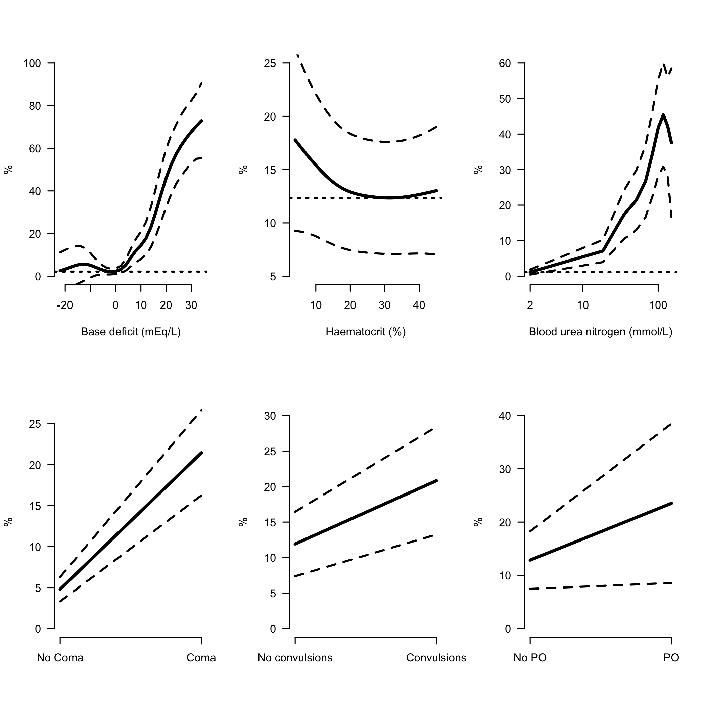
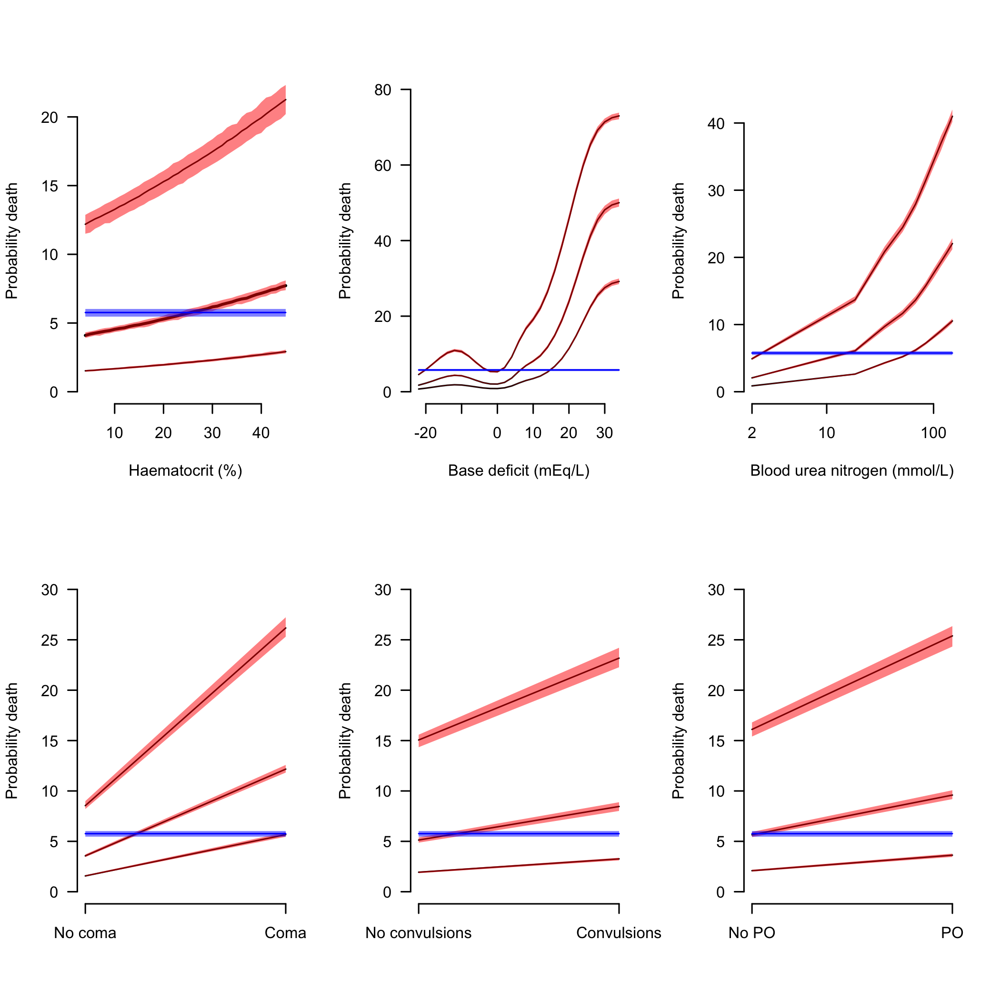

# Background

This looks at the severe malaria legacy dataset from MORU


# Imputation of missing variables

Quite a lot of the important covariates are missing in the older studies. We use linear regression to estimate these unknown variables. This section shows the results for single imputation - when fitting the final models we use multiple imputation.

* Mising base deficit is imputed using bicarbonate (if available) else using respiratory rate
* Missing Blood urea nitrogen is imputed using creatinine

Impute base deficit from bicarbonate

```r
BD_and_bicarbonate = !is.na(Leg_data$BD) & !is.na(Leg_data$bicarbonate)
print(paste('We have ', sum(BD_and_bicarbonate), 'observations for both bicarbonate and base deficit'))
```

```
## [1] "We have  5067 observations for both bicarbonate and base deficit"
```

```r
mod_impute1 = lmer(BD ~ bicarbonate + (1 | studyID) + (1 | country), data= Leg_data[BD_and_bicarbonate,])
missing_BD = is.na(Leg_data$BD)
Available_Bicarbonate = !is.na(Leg_data$bicarbonate)
print(paste(sum(missing_BD & Available_Bicarbonate), 'observations will now be imputed'))
```

```
## [1] "309 observations will now be imputed"
```

```r
# impute with model
Leg_data$BD[missing_BD & Available_Bicarbonate] = predict(mod_impute1,newdata=Leg_data[missing_BD & Available_Bicarbonate,], re.form=NA)
```

Impute base deficit from lactate

```r
BD_and_lactate = !is.na(Leg_data$BD) & !is.na(Leg_data$lactate)
print(paste('We have ', sum(BD_and_lactate), 'observations for both lactate and base deficit'))
```

```
## [1] "We have  632 observations for both lactate and base deficit"
```

```r
if(length(unique(Leg_data$studyID[BD_and_lactate]))==1){
  mod_impute2 = lm(BD ~ lactate, data= Leg_data[BD_and_lactate,])
} else {
  mod_impute2 = lmer(BD ~ lactate + (1 | studyID), data= Leg_data[BD_and_lactate,])
}
missing_BD = is.na(Leg_data$BD)
Available_Lactate = !is.na(Leg_data$lactate)
print(paste(sum(missing_BD & Available_Lactate), 'observations will now be imputed'))
```

```
## [1] "722 observations will now be imputed"
```

```r
# impute with model
Leg_data$BD[missing_BD & Available_Lactate] = predict(mod_impute2,newdata=Leg_data[missing_BD & Available_Lactate,], re.form=NA)
```

Impute base deficit from respiratory rate

```r
BD_and_rr = !is.na(Leg_data$BD) & !is.na(Leg_data$rr)
print(paste('We have ', sum(BD_and_rr), 'observations for both resp rate and base deficit'))
```

```
## [1] "We have  7572 observations for both resp rate and base deficit"
```

```r
mod_impute3 = lmer(BD ~ rr + (1 | studyID), data= Leg_data[BD_and_rr,])
missing_BD = is.na(Leg_data$BD)
Available_rr = !is.na(Leg_data$rr)
print(paste(sum(missing_BD & Available_rr), 'observations will now be imputed'))
```

```
## [1] "1650 observations will now be imputed"
```

```r
Leg_data$BD[missing_BD & Available_rr] = predict(mod_impute3,newdata=Leg_data[missing_BD & Available_rr,], re.form=NA)
```


Impute blood urea nitrogen from creatinine:

```r
BUN_and_cr = !is.na(Leg_data$BUN) & !is.na(Leg_data$creatinine)
print(paste('We have ', sum(BUN_and_cr), 'observations for both blood urea nitrogen and creatinine'))
```

```
## [1] "We have  1453 observations for both blood urea nitrogen and creatinine"
```

```r
mod_impute4 = lmer(BUN ~ creatinine + (1 | studyID), data= Leg_data[BUN_and_cr,])
missing_BUN = is.na(Leg_data$BUN)
Available_cr = !is.na(Leg_data$creatinine)
print(paste(sum(missing_BUN & Available_cr), 'observations will now be imputed'))
```

```
## [1] "679 observations will now be imputed"
```

```r
Leg_data$BUN[missing_BUN & Available_cr] = predict(mod_impute4,newdata=Leg_data[missing_BUN & Available_cr,], re.form=NA)
```

Resulting data we can now use:
The contributions of the different studies:

```r
vars_interest = c('outcome','HCT','LPAR_pct','BD','BUN','poedema',
                  'convulsions','coma','AgeInYear','drug_class')
complete_cases = apply(Leg_data[,vars_interest], 1, function(x) sum(is.na(x))) == 0
Complete_Leg_data = Leg_data[complete_cases,] # for the model fitting
Complete_Leg_data$studyID = as.factor(as.character(Complete_Leg_data$studyID))
# Whole dataset
table(Leg_data$studyID)
```

```
## 
##          AAV           AQ     AQGambia      AQUAMAT Core Malaria 
##          370          560          579         5494         1122 
##    SEAQUAMAT 
##         1461
```

```r
# in the complete dataset (all variables recorded)
table(Complete_Leg_data$studyID)
```

```
## 
##          AAV           AQ     AQGambia      AQUAMAT Core Malaria 
##          214          150          168         3666          657 
##    SEAQUAMAT 
##         1333
```

```r
Complete_Leg_data$drug_AS = 0
Complete_Leg_data$drug_AS[Complete_Leg_data$drug_class=='artemisinin']=1

# remove infinite log parasitaemias
ind_keep = !(is.infinite(Complete_Leg_data$LPAR_pct) | is.nan(Complete_Leg_data$LPAR_pct))
Complete_Leg_data = Complete_Leg_data[ind_keep,]

Complete_Leg_data$shock = as.numeric(Complete_Leg_data$shock)
Complete_Leg_data$poedema = as.numeric(Complete_Leg_data$poedema)
Complete_Leg_data$convulsions = as.numeric(Complete_Leg_data$convulsions)

Complete_Leg_data$country=as.factor(Complete_Leg_data$country)
```

Data summaries

```r
Africa = c('The Gambia','Mozambique','Ghana','Kenya','Nigeria','Tanzania','Uganda','Rwanda','Congo')
Asia = c('Thailand','Vietnam','Bangladesh','Myanmar','India','Indonesia')
writeLines(paste('Children in Africa:',
                 sum(Complete_Leg_data$AgeInYear < 15 & Complete_Leg_data$country %in% Africa)))
```

```
## Children in Africa: 3779
```

```r
writeLines(paste('Adults in Africa:',
                 sum(Complete_Leg_data$AgeInYear >= 15 & Complete_Leg_data$country %in% Africa)))
```

```
## Adults in Africa: 44
```

```r
writeLines(paste('Children in Asia:',
                 sum(Complete_Leg_data$AgeInYear < 15 & Complete_Leg_data$country %in% Asia)))
```

```
## Children in Asia: 198
```

```r
writeLines(paste('Adults in Asia:',
                 sum(Complete_Leg_data$AgeInYear >= 15 & Complete_Leg_data$country %in% Asia)))
```

```
## Adults in Asia: 2095
```


# Unadjusted associations for death


```r
Factors = c('HCT','coma','BD','poedema','convulsions','BUN')
x_hcts = seq(4,45, by=1)
x_comas = 0:1
x_conv = 1:2
x_poedema = 1:2
x_bd = seq(-22,35, by=2)
x_BUN = seq(2,150, length.out = 10)
```


```r
modHCT=gam(outcome ~ s(HCT) + s(studyID, bs='re') + s(country, bs='re'),
           data = Complete_Leg_data, family='binomial')

modcoma=gam(outcome ~ coma + s(studyID, bs='re') + s(country, bs='re'),
            data = Complete_Leg_data, family='binomial')

modBD=gam(outcome ~ s(BD) + s(studyID, bs='re') + s(country, bs='re'),
          data = Complete_Leg_data, family='binomial')

modpoedema=gam(outcome ~ poedema + s(studyID, bs='re') + s(country, bs='re'),
               data = Complete_Leg_data, family='binomial')

modconv=gam(outcome ~ convulsions + s(studyID, bs='re') + s(country, bs='re'),
            data = Complete_Leg_data, family='binomial')

modBUN=gam(outcome ~ s(BUN) + s(studyID, bs='re') + s(country, bs='re'),
           data = Complete_Leg_data, family='binomial')
```

<!-- -->


```r
mod_Adj = glmer(outcome ~ HCT + LPAR_pct + coma + convulsions +
                  poedema + log10(BUN) + BD + shock + drug_AS + 
                  AgeInYear + (1 | studyID) + (1 | country),
                data = Complete_Leg_data, family=binomial)
```

```
## Warning in checkConv(attr(opt, "derivs"), opt$par, ctrl =
## control$checkConv, : Model failed to converge with max|grad| = 0.00520319
## (tol = 0.001, component 1)
```

```r
summary(mod_Adj)
```

```
## Generalized linear mixed model fit by maximum likelihood (Laplace
##   Approximation) [glmerMod]
##  Family: binomial  ( logit )
## Formula: 
## outcome ~ HCT + LPAR_pct + coma + convulsions + poedema + log10(BUN) +  
##     BD + shock + drug_AS + AgeInYear + (1 | studyID) + (1 | country)
##    Data: Complete_Leg_data
## 
##      AIC      BIC   logLik deviance df.resid 
##   3461.7   3549.0  -1717.8   3435.7     6103 
## 
## Scaled residuals: 
##     Min      1Q  Median      3Q     Max 
## -3.9151 -0.3326 -0.1914 -0.1076 15.4112 
## 
## Random effects:
##  Groups  Name        Variance  Std.Dev. 
##  country (Intercept) 1.503e-01 0.3876496
##  studyID (Intercept) 3.413e-08 0.0001847
## Number of obs: 6116, groups:  country, 15; studyID, 6
## 
## Fixed effects:
##              Estimate Std. Error z value Pr(>|z|)    
## (Intercept) -8.064911   0.547098 -14.741  < 2e-16 ***
## HCT          0.016442   0.005285   3.111 0.001865 ** 
## LPAR_pct    -0.001385   0.060520  -0.023 0.981748    
## coma         1.338102   0.100922  13.259  < 2e-16 ***
## convulsions  0.513444   0.116870   4.393 1.12e-05 ***
## poedema      0.543694   0.385373   1.411 0.158297    
## log10(BUN)   1.778374   0.166022  10.712  < 2e-16 ***
## BD           0.121692   0.007219  16.856  < 2e-16 ***
## shock        0.007677   0.183289   0.042 0.966589    
## drug_AS     -0.343595   0.090340  -3.803 0.000143 ***
## AgeInYear    0.013703   0.003846   3.563 0.000367 ***
## ---
## Signif. codes:  0 '***' 0.001 '**' 0.01 '*' 0.05 '.' 0.1 ' ' 1
## 
## Correlation of Fixed Effects:
##             (Intr) HCT    LPAR_p coma   cnvlsn poedem l10(BU BD     shock 
## HCT         -0.245                                                        
## LPAR_pct    -0.009  0.031                                                 
## coma        -0.069 -0.028  0.074                                          
## convulsions -0.286 -0.072  0.017 -0.220                                   
## poedema     -0.708 -0.005 -0.006  0.027  0.000                            
## log10(BUN)  -0.417  0.064 -0.047 -0.015  0.103  0.006                     
## BD          -0.049  0.200 -0.175 -0.026  0.024 -0.008 -0.260              
## shock       -0.330 -0.020 -0.040  0.017 -0.006  0.004 -0.007 -0.099       
## drug_AS     -0.032 -0.012 -0.024  0.007  0.004 -0.025 -0.044 -0.019 -0.008
## AgeInYear    0.051 -0.176  0.003 -0.001  0.108 -0.049 -0.244  0.140 -0.055
##             drg_AS
## HCT               
## LPAR_pct          
## coma              
## convulsions       
## poedema           
## log10(BUN)        
## BD                
## shock             
## drug_AS           
## AgeInYear   -0.021
## convergence code: 0
## Model failed to converge with max|grad| = 0.00520319 (tol = 0.001, component 1)
```

Some summary functions we need

```r
fmed = function(x, ind){
  return(median(x[ind]))
}
f25 = function(x, ind){
  return(quantile(x[ind], probs = 0.25))
}
f75 = function(x, ind){
  return(quantile(x[ind], probs = 0.75))
}
```

Now let's make counterfactual retrodictions of anaemia on death for the patients in the database.


```r
myquantiles = c(0.025,0.5,0.975) # this is for a 95% CI
ys = 100*predict(mod_Adj, type='response')
BS = boot(data = ys, statistic = fmed, R = 300)
overall_median_mortality = quantile(BS$t, probs = myquantiles)
```


Compute the counterfactual outcomes:


```r
#*********HCT
HCT_CFs = array(dim = c(9, length(x_hcts)))
for(i in 1:length(x_hcts)){
  mydata = Complete_Leg_data
  mydata$HCT=x_hcts[i]
  ys = 100*predict(mod_Adj, newdata = mydata,  type='response')
  BSmed = boot(data = ys, statistic = fmed, R = 300)
  BS25 = boot(data = ys, statistic = f25, R = 300)
  BS75 = boot(data = ys, statistic = f75, R = 300)
  
  HCT_CFs[,i] = c(quantile(BS25$t, probs = myquantiles),
                  quantile(BSmed$t, probs = myquantiles),
                  quantile(BS75$t, probs = myquantiles))
}
#*********BD
BD_CFs = array(dim = c(9, length(x_bd)))
for(i in 1:length(x_bd)){
  mydata = Complete_Leg_data
  mydata$BD=x_bd[i]
  ys = 100*predict(mod_Adj, newdata = mydata, type='response')
  BSmed = boot(data = ys, statistic = fmed, R = 300)
  BS25 = boot(data = ys, statistic = f25, R = 300)
  BS75 = boot(data = ys, statistic = f75, R = 300)
  
  BD_CFs[,i] = c(quantile(BS25$t, probs = myquantiles),
                  quantile(BSmed$t, probs = myquantiles),
                  quantile(BS75$t, probs = myquantiles))
}
#*********BUN
BUN_CFs = array(dim = c(9, length(x_BUN)))
for(i in 1:length(x_BUN)){
  mydata = Complete_Leg_data
  mydata$BUN=x_BUN[i]
  ys = 100*predict(mod_Adj, newdata = mydata,  type='response')
  BSmed = boot(data = ys, statistic = fmed, R = 300)
  BS25 = boot(data = ys, statistic = f25, R = 300)
  BS75 = boot(data = ys, statistic = f75, R = 300)
  
  BUN_CFs[,i] = c(quantile(BS25$t, probs = myquantiles),
                  quantile(BSmed$t, probs = myquantiles),
                  quantile(BS75$t, probs = myquantiles))
}
#*********Coma
coma_CFs = array(dim = c(9, length(x_comas)))
for(i in 1:length(x_comas)){
  mydata = Complete_Leg_data
  mydata$coma=x_comas[i]
  ys = 100*predict(mod_Adj, newdata = mydata,  type='response')
  BSmed = boot(data = ys, statistic = fmed, R = 300)
  BS25 = boot(data = ys, statistic = f25, R = 300)
  BS75 = boot(data = ys, statistic = f75, R = 300)
  
  coma_CFs[,i] = c(quantile(BS25$t, probs = myquantiles),
                  quantile(BSmed$t, probs = myquantiles),
                  quantile(BS75$t, probs = myquantiles))
}
#*********poedema
PO_CFs = array(dim = c(9, length(x_poedema)))
for(i in 1:length(x_poedema)){
  mydata = Complete_Leg_data
  mydata$poedema=x_poedema[i]
  ys = 100*predict(mod_Adj, newdata = mydata, type='response')
  BSmed = boot(data = ys, statistic = fmed, R = 300)
  BS25 = boot(data = ys, statistic = f25, R = 300)
  BS75 = boot(data = ys, statistic = f75, R = 300)
  
  PO_CFs[,i] = c(quantile(BS25$t, probs = myquantiles),
                  quantile(BSmed$t, probs = myquantiles),
                  quantile(BS75$t, probs = myquantiles))
}
#*********Convulsions
Conv_CFs = array(dim = c(9, length(x_conv)))
for(i in 1:length(x_conv)){
  mydata = Complete_Leg_data
  mydata$convulsions=x_conv[i]
  ys = 100*predict(mod_Adj, newdata = mydata,  type='response')
  BSmed = boot(data = ys, statistic = fmed, R = 300)
  BS25 = boot(data = ys, statistic = f25, R = 300)
  BS75 = boot(data = ys, statistic = f75, R = 300)
  
  Conv_CFs[,i] = c(quantile(BS25$t, probs = myquantiles),
                  quantile(BSmed$t, probs = myquantiles),
                  quantile(BS75$t, probs = myquantiles))
}
```

The way to interpret this `counterfactual' plot is as follows: suppose that every individual in the dataset was assigned (as in a intervention) a specific haematocrit $X$, what would the resulting per patient probability of death be. Here we summarise these probabilities by the predicted mean probability of death and 80\% predictive intervals.

<!-- -->


## More complex GAM model

The GAM model allows for non-linear relationships between certain variables and the outcome.

Here we fit as non-linear the effect of age and haematocrit on mortality.
We add a random effect term for the studyID and a random effect term for the country.
This should be adjusting for a confounder of quality of care (which potentially impacts both general anaemia and outcome in study).


```r
mod_Adj_GAM = gam(outcome ~ s(HCT) + LPAR_pct + coma + convulsions +
                    poedema + s(log10(BUN)) + s(BD) + shock + 
                    drug_AS + AgeInYear + 
                    s(studyID, bs='re') + s(country, bs='re'),
                  data=Complete_Leg_data, family=binomial)
summary(mod_Adj_GAM)
```

```
## 
## Family: binomial 
## Link function: logit 
## 
## Formula:
## outcome ~ s(HCT) + LPAR_pct + coma + convulsions + poedema + 
##     s(log10(BUN)) + s(BD) + shock + drug_AS + AgeInYear + s(studyID, 
##     bs = "re") + s(country, bs = "re")
## 
## Parametric coefficients:
##              Estimate Std. Error z value Pr(>|z|)    
## (Intercept) -4.530730   0.486500  -9.313  < 2e-16 ***
## LPAR_pct    -0.003101   0.060892  -0.051 0.959383    
## coma         1.322933   0.101873  12.986  < 2e-16 ***
## convulsions  0.535438   0.118431   4.521 6.15e-06 ***
## poedema      0.570411   0.386281   1.477 0.139764    
## shock       -0.012978   0.184483  -0.070 0.943915    
## drug_AS     -0.340051   0.090801  -3.745 0.000180 ***
## AgeInYear    0.013332   0.003873   3.442 0.000577 ***
## ---
## Signif. codes:  0 '***' 0.001 '**' 0.01 '*' 0.05 '.' 0.1 ' ' 1
## 
## Approximate significance of smooth terms:
##                   edf Ref.df  Chi.sq  p-value    
## s(HCT)         1.0002  1.000   9.325  0.00226 ** 
## s(log10(BUN))  3.9507  4.927 109.367  < 2e-16 ***
## s(BD)          7.1761  8.160 298.082  < 2e-16 ***
## s(studyID)     0.5238  5.000   0.988  0.27679    
## s(country)    10.8301 14.000  83.454 3.13e-14 ***
## ---
## Signif. codes:  0 '***' 0.001 '**' 0.01 '*' 0.05 '.' 0.1 ' ' 1
## 
## R-sq.(adj) =  0.272   Deviance explained = 29.6%
## UBRE = -0.43842  Scale est. = 1         n = 6116
```


Now we compute the corresponding counterfactual probabilities of death for the dataset for all values of the haematocrit:


```r
#*********HCT
HCT_CFs = array(dim = c(9, length(x_hcts)))
for(i in 1:length(x_hcts)){
  mydata = Complete_Leg_data
  mydata$HCT=x_hcts[i]
  ys = 100*predict(mod_Adj_GAM, newdata = mydata,  type='response')
  BSmed = boot(data = ys, statistic = fmed, R = 300)
  BS25 = boot(data = ys, statistic = f25, R = 300)
  BS75 = boot(data = ys, statistic = f75, R = 300)
  
  HCT_CFs[,i] = c(quantile(BS25$t, probs = myquantiles),
                  quantile(BSmed$t, probs = myquantiles),
                  quantile(BS75$t, probs = myquantiles))
}
#*********BD
BD_CFs = array(dim = c(9, length(x_bd)))
for(i in 1:length(x_bd)){
  mydata = Complete_Leg_data
  mydata$BD=x_bd[i]
  ys = 100*predict(mod_Adj_GAM, newdata = mydata, type='response')
  BSmed = boot(data = ys, statistic = fmed, R = 300)
  BS25 = boot(data = ys, statistic = f25, R = 300)
  BS75 = boot(data = ys, statistic = f75, R = 300)
  
  BD_CFs[,i] = c(quantile(BS25$t, probs = myquantiles),
                  quantile(BSmed$t, probs = myquantiles),
                  quantile(BS75$t, probs = myquantiles))
}
#*********BUN
BUN_CFs = array(dim = c(9, length(x_BUN)))
for(i in 1:length(x_BUN)){
  mydata = Complete_Leg_data
  mydata$BUN=x_BUN[i]
  ys = 100*predict(mod_Adj_GAM, newdata = mydata,  type='response')
  BSmed = boot(data = ys, statistic = fmed, R = 300)
  BS25 = boot(data = ys, statistic = f25, R = 300)
  BS75 = boot(data = ys, statistic = f75, R = 300)
  
  BUN_CFs[,i] = c(quantile(BS25$t, probs = myquantiles),
                  quantile(BSmed$t, probs = myquantiles),
                  quantile(BS75$t, probs = myquantiles))
}
#*********Coma
coma_CFs = array(dim = c(9, length(x_comas)))
for(i in 1:length(x_comas)){
  mydata = Complete_Leg_data
  mydata$coma=x_comas[i]
  ys = 100*predict(mod_Adj_GAM, newdata = mydata,  type='response')
  BSmed = boot(data = ys, statistic = fmed, R = 300)
  BS25 = boot(data = ys, statistic = f25, R = 300)
  BS75 = boot(data = ys, statistic = f75, R = 300)
  
  coma_CFs[,i] = c(quantile(BS25$t, probs = myquantiles),
                  quantile(BSmed$t, probs = myquantiles),
                  quantile(BS75$t, probs = myquantiles))
}
#*********poedema
PO_CFs = array(dim = c(9, length(x_poedema)))
for(i in 1:length(x_poedema)){
  mydata = Complete_Leg_data
  mydata$poedema=x_poedema[i]
  ys = 100*predict(mod_Adj_GAM, newdata = mydata, type='response')
  BSmed = boot(data = ys, statistic = fmed, R = 300)
  BS25 = boot(data = ys, statistic = f25, R = 300)
  BS75 = boot(data = ys, statistic = f75, R = 300)
  
  PO_CFs[,i] = c(quantile(BS25$t, probs = myquantiles),
                  quantile(BSmed$t, probs = myquantiles),
                  quantile(BS75$t, probs = myquantiles))
}
#*********Convulsions
Conv_CFs = array(dim = c(9, length(x_conv)))
for(i in 1:length(x_conv)){
  mydata = Complete_Leg_data
  mydata$convulsions=x_conv[i]
  ys = 100*predict(mod_Adj_GAM, newdata = mydata,  type='response')
  BSmed = boot(data = ys, statistic = fmed, R = 300)
  BS25 = boot(data = ys, statistic = f25, R = 300)
  BS75 = boot(data = ys, statistic = f75, R = 300)
  
  Conv_CFs[,i] = c(quantile(BS25$t, probs = myquantiles),
                  quantile(BSmed$t, probs = myquantiles),
                  quantile(BS75$t, probs = myquantiles))
}
```

We see that the effect of haematocrit on mortality is non-linear under this model: below 20 is protective, above 20 plateaus out:

<!-- -->


## Model comparison

Which model is better fit in terms of AIC


```r
print(AIC(mod_Adj_GAM, mod_Adj))
```

```
##                   df      AIC
## mod_Adj_GAM 31.48088 3434.619
## mod_Adj     13.00000 3461.685
```

And in terms of deviance


```r
print(list(mod_Adj_GAM=deviance(mod_Adj_GAM),
           mod_Adj = deviance(mod_Adj)))
```

```
## $mod_Adj_GAM
## [1] 3371.658
## 
## $mod_Adj
## [1] 3400.295
```

