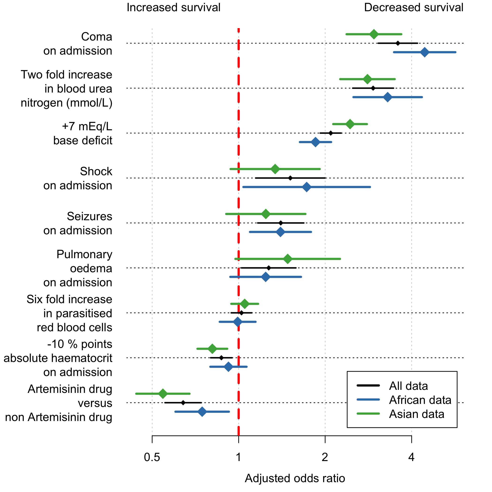

# Background

This looks at the severe malaria legacy dataset from MORU


```r
load('RData/Data.RData')
m$drug_AS = 0
m$drug_AS[m$drug_class=='artemisinin']=1
m$country = as.factor(as.character(m$country))
m$poedema[m$continent=='Africa']=NA
```


Data summaries

```r
writeLines(paste('Children less than 12 years:',
                 sum(m$AgeInYear < 12)))
```

```
## Children less than 12 years: 5635
```

```r
writeLines(paste('Adults:',
                 sum(m$AgeInYear >= 12)))
```

```
## Adults: 3405
```

```r
writeLines(paste('Children in Africa:',
                 sum(m$AgeInYear < 12 & m$continent == 'Africa')))
```

```
## Children in Africa: 5446
```

```r
writeLines(paste('Adults in Africa:',
                 sum(m$AgeInYear >= 12 & m$continent== 'Africa')))
```

```
## Adults in Africa: 96
```

```r
writeLines(paste('Children in Asia:',
                 sum(m$AgeInYear < 12 & m$continent == 'Asia')))
```

```
## Children in Asia: 189
```

```r
writeLines(paste('Adults in Asia:',
                 sum(m$AgeInYear >= 12 & m$continent == 'Asia')))
```

```
## Adults in Asia: 3309
```

```r
writeLines('\nNumber of patients per study:\n')
```

```
## 
## Number of patients per study:
```

```r
table(m$studyID)
```

```
## 
##          AAV           AQ      AQUAMAT Core Malaria           QC 
##          370          560         5494         1107           48 
##    SEAQUAMAT 
##         1461
```

```r
writeLines('\nStudies broken down by country:\n')
```

```
## 
## Studies broken down by country:
```

```r
table(m$country,m$studyID)
```

```
##             
##               AAV   AQ AQUAMAT Core Malaria   QC SEAQUAMAT
##   Bangladesh    0    0       0          424    0       453
##   Congo         0    0     422            0    0         0
##   Ghana         0    0     436            0    0         0
##   India         0    0       0            0    0       142
##   Indonesia     0    0       0            0    0       289
##   Kenya         0    0     442            0    0         0
##   Mozambique    0    0     732            0    0         0
##   Myanmar       0    0       0            0    0       577
##   Nigeria       0    0     450            0    0         0
##   Rwanda        0    0     386            0    0         0
##   Tanzania      0    0    1461            0    0         0
##   Thailand      0    0       0          683    0         0
##   The Gambia    0    0     502            0   48         0
##   Uganda        0    0     663            0    0         0
##   Vietnam     370  560       0            0    0         0
```

```r
for(ss in unique(m$studyID)){
  xx = filter(m, studyID==ss)
  writeLines(sprintf('\nThe mortality in %s was %s%%', ss, round(mean(xx$outcome)*100)))
}
```

```
## 
## The mortality in Core Malaria was 22%
## 
## The mortality in QC was 17%
## 
## The mortality in AAV was 10%
## 
## The mortality in SEAQUAMAT was 19%
## 
## The mortality in AQUAMAT was 10%
## 
## The mortality in AQ was 15%
```

# Multiple imputation using linear relationships

The number of missing variables in the pooled data:

```r
round(apply(m,2, function(x) sum(is.na(x))),0)
```

```
##           year        country        studyID     drug_class          shock 
##            560              0              0              0              0 
##    convulsions        poedema        outcome      AgeInYear           coma 
##              0           5542              0              0            239 
##            HCT       LPAR_pct             BD    bicarbonate             rr 
##            870           1882           2375           3679            369 
##        lactate            BUN     creatinine  hypoglycaemia Timetodeathhrs 
##           7423           1544           7242            115           7850 
##      continent        drug_AS    transfusion 
##              0              0           9040
```

```r
round(apply(m,2, function(x) 100*sum(is.na(x)))/nrow(m),0)
```

```
##           year        country        studyID     drug_class          shock 
##              6              0              0              0              0 
##    convulsions        poedema        outcome      AgeInYear           coma 
##              0             61              0              0              3 
##            HCT       LPAR_pct             BD    bicarbonate             rr 
##             10             21             26             41              4 
##        lactate            BUN     creatinine  hypoglycaemia Timetodeathhrs 
##             82             17             80              1             87 
##      continent        drug_AS    transfusion 
##              0              0            100
```

We make a few data adjustments for the model imputation and fitting:

```r
m$LPAR_pct[is.infinite(m$LPAR_pct)] = 0
```

We run the multiple imputation using chained equations.

Imputation models V2


First we setup these linear models. Random effect terms are added for study and country.


# Logistic regression model

We fit the full model with adjustments as specified in the Methods section:


Compute the overall parameter estimates:

```r
# extract the fixed and random effects from all the model fits
# These functions then compute the overall estimates
FixedEffs = modelFixedEff(modList)
```

```
## Warning in modelFixedEff(modList): Between imputation variance is very
## small, are imputation sets too similar?
```

```r
RandEffs = modelRandEffStats(modList)
print(FixedEffs)
```

```
##             term    estimate   std.error   statistic           df
## 1    (Intercept) -6.48014987 0.310601980 -20.8631957 8.005980e+06
## 2             BD  0.10541306 0.006141572  17.1638550 1.716882e+10
## 3           coma  1.27600268 0.080163747  15.9174530 4.834417e+06
## 4   convulsions1  0.33745186 0.094352449   3.5765035 4.224598e+08
## 5        drug_AS -0.44484673 0.074269371  -5.9896391 2.833785e+09
## 6            HCT  0.01384482 0.004392693   3.1517831 8.596128e+10
## 7  hypoglycaemia  0.61017216 0.118892206   5.1321461 8.890343e+07
## 8      log2(BUN)  0.53876286 0.041736392  12.9087072 1.599952e+08
## 9       LPAR_pct  0.02919452 0.054286993   0.5377811 2.501577e+08
## 10      poedema1  0.24086203 0.111373543   2.1626503 3.812967e+04
## 11        shock1  0.41411472 0.141959217   2.9171387 8.960673e+08
```

```r
print(RandEffs)
```

```
##                               term             group  estimate   std.error
## 1         sd_(Intercept).continent         continent 0.1864660 0.008492146
## 2 sd_(Intercept).country:continent country:continent 0.4656683 0.003764568
```

```r
FixedEffs$Scalar_f = as.numeric(mapvalues(x = FixedEffs$term, 
                                          from = c("(Intercept)",
                                                   "BD",
                                                   "coma",
                                                   "convulsions1",
                                                   "drug_AS",
                                                   "HCT",
                                                   "hypoglycaemia",
                                                   "log2(BUN)",
                                                   "LPAR_pct",
                                                   "shock1",
                                                   "poedema1"),
                                          to = as.numeric(c(1, 7, 1, 1, 1, 10, 1,2,log10(6),1, 1))))
FixedEffs$std.error=as.numeric(FixedEffs$std.error)
FixedEffs$estimate=as.numeric(FixedEffs$estimate)

# Compute 95% CIs
Results = data.frame(lowerCI = exp(FixedEffs$Scalar_f*(FixedEffs$estimate -
                                                         1.96*FixedEffs$std.error)),
                     mean = exp(FixedEffs$Scalar_f*(FixedEffs$estimate)),
                     upperCI = exp(FixedEffs$Scalar_f*(FixedEffs$estimate +
                                                         1.96*FixedEffs$std.error)))
rownames(Results) = FixedEffs$term
```

Aggregate results for plotting:

```r
writeLines(sprintf('Standard deviation of base deficit in patient population is %s',
                   round(sd(m$BD,na.rm=T))))
```

```
## Standard deviation of base deficit in patient population is 7
```

```r
writeLines(sprintf('Standard deviation of blood urea nitrogen in patient population is %s',
                   round(2^sd(log2(m$BUN),na.rm=T))))
```

```
## Standard deviation of blood urea nitrogen in patient population is 2
```

```r
writeLines(sprintf('Standard deviation of parasitised RBCs in patient population is %s',
                   round(10^sd(m$LPAR_pct,na.rm=T))))
```

```
## Standard deviation of parasitised RBCs in patient population is 6
```

```r
writeLines(sprintf('Standard deviation of haematocrits in patient population is %s',
                   round(sd(m$HCT,na.rm=T))))
```

```
## Standard deviation of haematocrits in patient population is 10
```


Make the 'forest' plot:

```r
Results = Results[rownames(Results) %in% c('BD','coma','convulsions1','drug_AS','HCT',
                                           'log2(BUN)','poedema1','LPAR_pct','shock1'),]
Results$Names =mapvalues(rownames(Results),
                         from = c("drug_AS",
                                  "HCT",
                                  "LPAR_pct",
                                  "convulsions1",
                                  "shock1",
                                  "poedema1",
                                  "log2(BUN)",
                                  "BD", 
                                  "coma"),
                         to = c('Artemisinin drug\nversus\nnon Artemisinin drug',
                                '-10 % points\nabsolute haematocrit\non admission',
                                'Six fold increase\n in parasitised\nred blood cells',
                                'Seizures\non admission',
                                'Shock\non admission',
                                'Pulmonary\noedema\non admission',
                                'Two fold increase\nin blood urea\nnitrogen (mmol/L)',
                                '+7 mEq/L\nbase deficit',
                                'Coma\non admission'))
Results['HCT',c("lowerCI","mean","upperCI")] = 1/Results['HCT',c("lowerCI","mean","upperCI")]
Results = arrange(Results, mean)
print(round(Results[,c("lowerCI","mean","upperCI")],2))
```

```
##   lowerCI mean upperCI
## 1    0.55 0.64    0.74
## 2    0.95 0.87    0.80
## 3    0.94 1.02    1.11
## 4    1.02 1.27    1.58
## 5    1.16 1.40    1.69
## 6    1.15 1.51    2.00
## 7    1.92 2.09    2.28
## 8    2.49 2.94    3.46
## 9    3.06 3.58    4.19
```

```r
par(bty='n', las=1, mar = c(4,9,2,2))

xlims = c(0.5, 4.5)
plot(NA,NA, xlim= log2(xlims), ylim = c(0,1),xaxt='n',
     xlab='', ylab='', yaxt='n')
abline(v= seq(-1,3,by=1),col = "lightgray", lty = "dotted",lwd = par("lwd"))
axis(1, at = log2(c(0.5,1, 2,4)), labels = c(0.5,1, 2,4))
abline(v=0, lty=2, lwd=3, col='red')
yindex =1
ypos = seq(0,1,length.out = nrow(Results))


for(i in 1:nrow(Results)){
  arrows(log2(Results[i,'lowerCI']),ypos[yindex],
         log2(Results[i,'upperCI']),ypos[yindex],
         length=0.0, angle=90, code=3, 
         col = 'black',lwd=3)
  points(log2(Results[i,'mean']),ypos[yindex],pch=18,cex=2)
  yindex=yindex+1
  
}
abline(h=ypos, lty=3)
axis(side = 2, at = ypos, labels = Results$Names,tick=FALSE)
mtext(side=1, line = 2.5, text = 'Adjusted odds ratio')
mtext(side = 3, line = 1, text = 'Increased survival',adj = 0)
mtext(side = 3, line = 1, text = 'Decreased survival',adj = 1)
```

<!-- -->


# Logistic regression model with subsets of the data

### Only Asian patients

This provides a sensitivity analysis regarding confounding by sepsis.


```r
SM_Impute_List_Asia = list()
for (i in 1:length(SM_Impute_List)){
  SM_Impute_List_Asia[[i]] = filter(SM_Impute_List[[i]], continent == 'Asia')
}
```

We fit the full model with adjustments as specified in the Methods section:


### Only African patients


```r
SM_Impute_List_Africa = list()
for (i in 1:length(SM_Impute_List)){
  SM_Impute_List_Africa[[i]] = filter(SM_Impute_List[[i]], continent == 'Africa')#s,HCT>9)
}
```

We fit the full model with adjustments as specified in the Methods section:


### Plot in comparison the global estimate


```r
Results_Africa = Results_Africa[rownames(Results_Africa) %in% c('BD','coma','convulsions1',
                                                                'drug_AS','HCT',
                                                                'log2(BUN)','poedema1',
                                                                'LPAR_pct','shock1'),]
Results_Africa$Names =mapvalues(rownames(Results_Africa),
                                from = c("drug_AS",
                                         "HCT",
                                         "LPAR_pct",
                                         "convulsions1",
                                         "shock1",
                                         "poedema1",
                                         "log2(BUN)",
                                         "BD", 
                                         "coma"),
                                to = c('Artemisinin drug\nversus\nnon Artemisinin drug',
                                       '-10 % points\nabsolute haematocrit\non admission',
                                       'Six fold increase\n in parasitised\nred blood cells',
                                       'Seizures\non admission',
                                       'Shock\non admission',
                                       'Pulmonary\noedema\non admission',
                                       'Two fold increase\nin blood urea\nnitrogen (mmol/L)',
                                       '+7 mEq/L\nbase deficit',
                                       'Coma\non admission'))
Results_Africa['HCT',c("lowerCI","mean","upperCI")] = 1/Results_Africa['HCT',c("lowerCI","mean","upperCI")]


Results_Asia = Results_Asia[rownames(Results_Asia) %in% c('BD','coma','convulsions1',
                                                          'drug_AS','HCT',
                                                          'log2(BUN)','poedema1',
                                                          'LPAR_pct','shock1'),]
Results_Asia$Names =mapvalues(rownames(Results_Asia),
                              from = c("drug_AS",
                                       "HCT",
                                       "LPAR_pct",
                                       "convulsions1",
                                       "shock1",
                                       "poedema1",
                                       "log2(BUN)",
                                       "BD", 
                                       "coma"),
                              to = c('Artemisinin drug\nversus\nnon Artemisinin drug',
                                     '-10 % points\nabsolute haematocrit\non admission',
                                     'Six fold increase\n in parasitised\nred blood cells',
                                     'Seizures\non admission',
                                     'Shock\non admission',
                                     'Pulmonary\noedema\non admission',
                                     'Two fold increase\nin blood urea\nnitrogen (mmol/L)',
                                     '+7 mEq/L\nbase deficit',
                                     'Coma\non admission'))
Results_Asia['HCT',c("lowerCI","mean","upperCI")] = 1/Results_Asia['HCT',c("lowerCI","mean","upperCI")]
```


```r
library(RColorBrewer)
par(bty='n', las=1, mar = c(4,9,2,2))
epsilon = 0.2 * (1/(nrow(Results)-1))

xlims = c(0.45, 5.5)
plot(NA,NA, xlim= log2(xlims), ylim = c(-2*epsilon,1),xaxt='n',
     xlab='', ylab='', yaxt='n')
abline(v= seq(-1,3,by=1),col = "lightgray", lty = "dotted",lwd = par("lwd"))
axis(1, at = log2(c(0.5,1, 2,4)), labels = c(0.5,1, 2,4))
abline(v=0, lty=2, lwd=3, col='red')
yindex =1
ypos = seq(0,1,length.out = nrow(Results))
cols = brewer.pal(8,'Set1')[2:3]
col1 = cols[1] #adjustcolor('blue',alpha.f = .7)
col2 = cols[2] #adjustcolor('green',alpha.f = .7)
 
for(i in 1:nrow(Results)){
  arrows(log2(Results[i,'lowerCI']),ypos[yindex],
         log2(Results[i,'upperCI']),ypos[yindex],
         length=0.0, angle=90, code=3, 
         col = 'black',lwd=2)
  points(log2(Results[i,'mean']),ypos[yindex],pch=18,cex=1)
  
  ind1 = Results_Africa$Names == Results$Names[i]
  ind2 = Results_Asia$Names == Results$Names[i]
  
  arrows(log2(Results_Africa[ind1,'lowerCI']),ypos[yindex]-epsilon,
         log2(Results_Africa[ind1,'upperCI']),ypos[yindex]-epsilon,
         length=0.0, angle=90, code=3, 
         col = col1,lwd=3)
  points(log2(Results_Africa[ind1,'mean']),ypos[yindex]-epsilon,pch=18,cex=2,col=col1)
  
  arrows(log2(Results_Asia[ind2,'lowerCI']),ypos[yindex]+epsilon,
         log2(Results_Asia[ind2,'upperCI']),ypos[yindex]+epsilon,
         length=0.0, angle=90, code=3, 
         col = col2,lwd=3)
  points(log2(Results_Asia[ind2,'mean']),ypos[yindex]+epsilon,pch=18,cex=2,col=col2)
  
  yindex=yindex+1
  
  
}
abline(h=ypos, lty=3)
axis(side = 2, at = ypos, labels = Results$Names,tick=FALSE)
mtext(side=1, line = 2.5, text = 'Adjusted odds ratio')
mtext(side = 3, line = 1, text = 'Increased survival',adj = 0)
mtext(side = 3, line = 1, text = 'Decreased survival',adj = 1)
legend('bottomright', col = c('black',cols), bty='y',bg = 'white',
       legend = c('All data','African data','Asian data'),lwd=3, inset = 0.02)
```

<!-- -->

