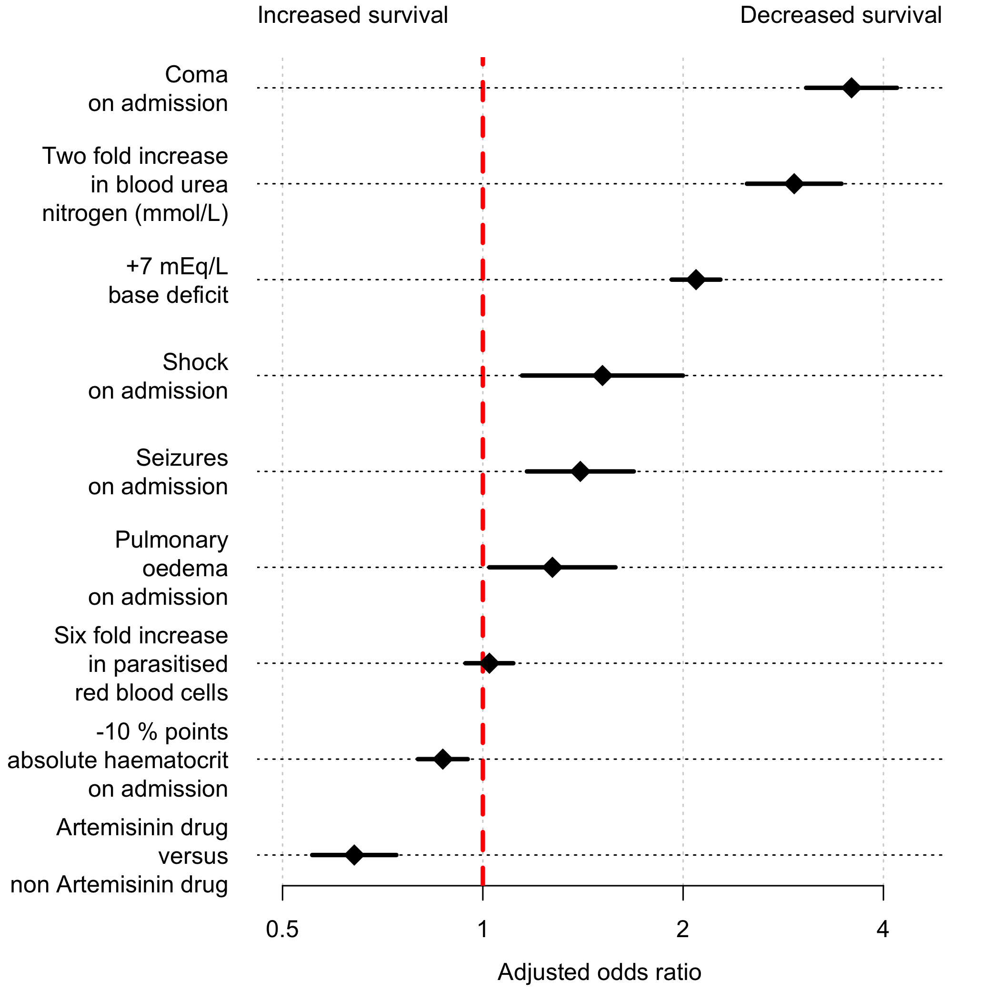

# Background

This looks at the severe malaria legacy dataset from MORU


Data summaries

```r
Africa = c('The Gambia','Mozambique','Ghana','Kenya','Nigeria','Tanzania','Uganda','Rwanda','Congo')
Asia = c('Thailand','Vietnam','Bangladesh','Myanmar','India','Indonesia')
writeLines(paste('Children in Africa:',
                 sum(m$AgeInYear < 15 & m$country %in% Africa)))
```

```
## Children in Africa: 5426
```

```r
writeLines(paste('Adults in Africa:',
                 sum(m$AgeInYear >= 15 & m$country %in% Africa)))
```

```
## Adults in Africa: 68
```

```r
writeLines(paste('Children in Asia:',
                 sum(m$AgeInYear < 15 & m$country %in% Asia)))
```

```
## Children in Asia: 282
```

```r
writeLines(paste('Adults in Asia:',
                 sum(m$AgeInYear >= 15 & m$country %in% Asia)))
```

```
## Adults in Asia: 3225
```

### Multiple imputation using missForest

The number of missing variables in the pooled data:

```r
apply(m,2, function(x) sum(is.na(x)))
```

```
##   StudyNumber          year       country       studyID    drug_class 
##             0           560             0             0             0 
##          drug         shock   convulsions       poedema       outcome 
##             0             0             0             0             0 
##     AgeInYear          coma           HCT        paraul          parc 
##             0           498           867          1321          1871 
##          LPAR      LPAR_pct            BD   bicarbonate            rr 
##          2027          1871          2325          3628           358 
##       lactate           BUN    creatinine hypoglycaemia   transfusion 
##          7940          1494          7193            67          2323 
##         study       drug_AS 
##             0             0
```

We make a few data adjustments for the model imputation and fitting:

```r
m$LPAR_pct[is.infinite(m$LPAR_pct)] = 0
m$drug_class = as.factor(m$drug_class)
m$poedema = as.factor(m$poedema)
m$coma = as.factor(m$coma)
m$convulsions = as.factor(m$convulsions)
m$transfusion = as.factor(m$transfusion)
```

We run the multiple imputation using missForest


# Logistic regression model

We fit the full model with adjustments as specified in the Methods section:

```r
if(RUN_MODELS){
  # the model formula
  DAG_fmla = "outcome ~ HCT + LPAR_pct + coma + convulsions + poedema + 
              log2(BUN) + BD + shock + hypoglycaemia + 
              drug_AS + (1 | studyID) + (1 | country)"
  # fit the model to each dataset
  modList= glmerModList(DAG_fmla, data = SM_Impute_List, family=binomial,parallel = T) 
  # save the output
  save(modList, file = 'RData/Models_List.RData')
} else {
  load('RData/Models_List.RData')
}
```

Compute the overall parameter estimates:

```r
# extract the fixed and random effects from all the model fits
# These functions then compute the overall estimates
FixedEffs = modelFixedEff(modList)
```

```
## Warning: package 'bindrcpp' was built under R version 3.4.4
```

```r
RandEffs = modelRandEffStats(modList)
print(FixedEffs)
```

```
##             term    estimate   std.error   statistic          df
## 1    (Intercept) -6.56461496 0.282504672 -23.2371907    10356338
## 2             BD  0.10832293 0.006259713  17.3047754 10019975088
## 3          coma1  1.32417717 0.083258020  15.9044998    10440922
## 4   convulsions1  0.34484962 0.095108121   3.6258693   888987110
## 5        drug_AS -0.42616573 0.074364834  -5.7307428  1307946232
## 6            HCT  0.01433657 0.004370380   3.2803932 23249949489
## 7  hypoglycaemia  0.52861530 0.118788063   4.4500709   110690781
## 8      log2(BUN)  0.53624415 0.041823703  12.8215368   137175109
## 9       LPAR_pct  0.00621715 0.043713806   0.1422239   106859628
## 10      poedema1  0.76818730 0.312608639   2.4573451    95785652
## 11        shock1  0.33859632 0.143005593   2.3677138    73720899
```

```r
print(RandEffs)
```

```
##                     term   group   estimate   std.error
## 1 sd_(Intercept).country country 0.49774632 0.003911993
## 2 sd_(Intercept).studyID studyID 0.04230875 0.018644726
```

Aggregate results for plotting:

```r
# The scalar multiples to put the AORs on the correct scales
Scalar_f = c(1, 10, 1, 1, 1, 10, 1, log2(3), 1, 1, 1)
# Compute 95% CIs
Results = data.frame(lowerCI = exp(Scalar_f*(FixedEffs$estimate -
                                               1.96*FixedEffs$std.error)),
                     mean = exp(Scalar_f*(FixedEffs$estimate)),
                     upperCI = exp(Scalar_f*(FixedEffs$estimate +
                                               1.96*FixedEffs$std.error)))
rownames(Results) = FixedEffs$term
```

Make the 'forest' plot:

```r
plotting_ind = rownames(Results) %in% c('BD','coma1','convulsions1','drug_AS','HCT','log2(BUN)','poedema1')
Results = Results[plotting_ind,]
x_ind = sort.int(Results$mean, index.return = T)$ix
Results = Results[x_ind,]
par(bty='n', las=1, mar = c(3,9,2,2))

Y_Labels = c('+10 mEq/L\nbase deficit',
             'Coma\non admission',
             'Seizures\non admission',
             'Artemisinin drug\nversus\nnon Artemisinin drug',
             '-10 % points\nabsolute haematocrit\non admission',
             '3 fold increase\nin blood urea\nnitrogen (mmol/L)',
             'Pulmonary\nOedema\non admission')
Y_Labels = Y_Labels[x_ind]

xlims = c(0.5, 4.5)
plot(NA,NA, xlim= log2(xlims), ylim = c(0,1),xaxt='n',
     xlab='', ylab='', yaxt='n')
axis(1, at = log2(c(0.5,1, 2,4)), labels = c(0.5,1, 2,4))
abline(v=0, lty=2, lwd=3, col='red')
yindex =1
ypos = seq(0,1,length.out = sum(plotting_ind))

Results['HCT',] = 1/Results['HCT',]
for(i in 1:nrow(Results)){
  arrows(log2(Results[i,'lowerCI']),ypos[yindex],
         log2(Results[i,'upperCI']),ypos[yindex],
         length=0.05, angle=90, code=3, 
         col = 'black',lwd=3)
  points(log2(Results[i,'mean']),ypos[yindex],pch=18,cex=2)
  yindex=yindex+1
  
}
abline(h=ypos, lty=3)
axis(side = 2, at = ypos, labels = Y_Labels,tick=FALSE)
mtext(side=1, line = 2, text = 'Adjusted odds ratio')
mtext(side = 3, line = 1, text = 'Increased survival',adj = 0)
mtext(side = 3, line = 1, text = 'Decreased survival',adj = 1)
```

<!-- -->


