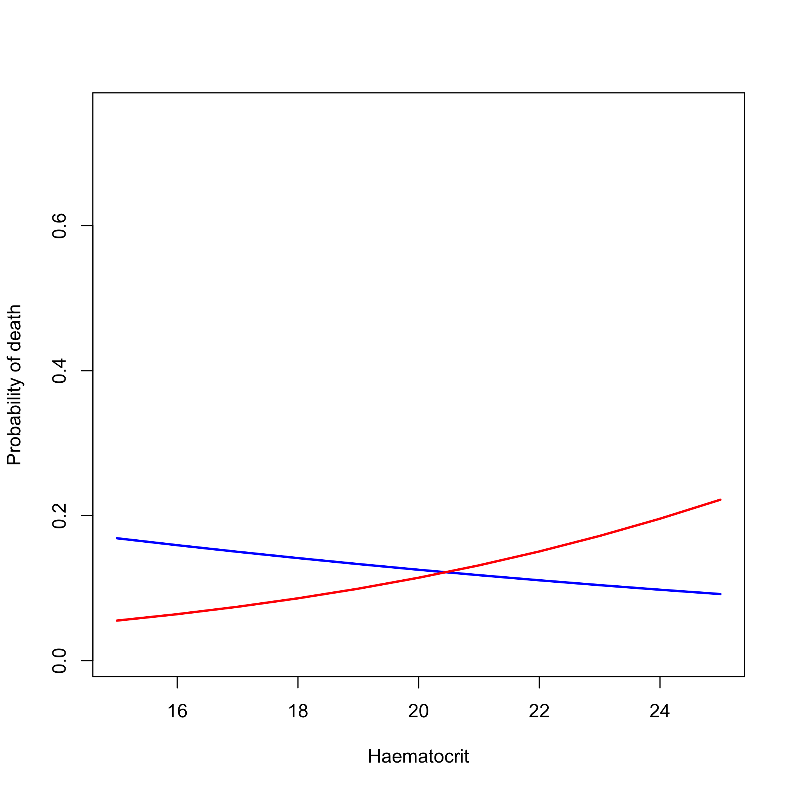

## Load dataset


```r
load('RData/Multiple_Imputed_Datasets.RData')
```


### Inverse probability weighting: Transfusion studies

We stratify by time to death, to remove collider bias.
Select the patients who survive past 4 hours

```r
load('RData/Data.RData')
#### We're just looking at the those who didn't die before 4 hours post admission
m$Outcome4hours = 0
m$Outcome4hours[!is.na(m$Timetodeathhrs) & m$Timetodeathhrs <= 4] = 1
# We only look at individuals who survive past 4 hours
m = filter(m, Outcome4hours==0)

Transfusion_Data = m[m$studyID%in%c('AQUAMAT'),]
round(100*table(Transfusion_Data$transfusion)/nrow(Transfusion_Data),1)
```

```
## 
##    0    1 
## 44.8 55.2
```

```r
unique_ids_Transfusion = Transfusion_Data$Unique_ID
```


```r
load('RData/Multiple_Imputed_Datasets.RData')
for(i in 1:length(SM_Impute_List)){
  ind = SM_Impute_List[[i]]$Unique_ID %in% unique_ids_Transfusion & 
    SM_Impute_List[[i]]$AgeInYear <= 12
  SM_Impute_List[[i]] = SM_Impute_List[[i]][ind,]
  SM_Impute_List[[i]]$country = as.character(SM_Impute_List[[i]]$country)
  SM_Impute_List[[i]]$country[SM_Impute_List[[i]]$country=='The Gambia'] = 'The_Gambia'
  SM_Impute_List[[i]]$country = as.factor(SM_Impute_List[[i]]$country)
}
```


```r
k = 1
par(mfrow=c(3,3))
for(cc in unique(SM_Impute_List[[k]]$country)){
  transfused = SM_Impute_List[[k]]$transfusion==1
  ind_country = SM_Impute_List[[k]]$country == cc
  
  hist(SM_Impute_List[[k]]$HCT[ind_country & transfused],
       breaks = seq(4,50, by = 1),
       col = adjustcolor('red',alpha.f = .3),
       main=cc, xlab='Haematocrit (%)', ylab = 'Number of patients')
  hist(SM_Impute_List[[k]]$HCT[ind_country & !transfused],
       breaks = 4:50,
       add=T,col=adjustcolor('blue',alpha.f = .3))
  writeLines(sprintf('The mortality in %s was %s%%', cc,
                     round(100*mean(SM_Impute_List[[k]]$outcome[ind_country]))))
}
```

```
## The mortality in Mozambique was 9%
```

```
## The mortality in Congo was 2%
```

```
## The mortality in Ghana was 4%
```

```
## The mortality in Nigeria was 7%
```

```
## The mortality in Kenya was 8%
```

```
## The mortality in Tanzania was 11%
```

```
## The mortality in Rwanda was 5%
```

```
## The mortality in The_Gambia was 8%
```

<!-- -->

```
## The mortality in Uganda was 5%
```

```r
table(SM_Impute_List[[k]]$country, SM_Impute_List[[k]]$coma)
```

```
##             
##                 0    1
##   Congo       382   31
##   Ghana       261  173
##   Kenya       240  193
##   Mozambique  160  483
##   Nigeria     321  120
##   Rwanda      307   73
##   Tanzania   1089  313
##   The_Gambia  271  214
##   Uganda      533  122
```

```r
table(SM_Impute_List[[k]]$country, SM_Impute_List[[k]]$transfusion)
```

```
##             
##                0   1
##   Congo       14 399
##   Ghana      244 190
##   Kenya      293 140
##   Mozambique 385 258
##   Nigeria    201 240
##   Rwanda     214 166
##   Tanzania   540 862
##   The_Gambia 280 205
##   Uganda     172 483
```


We exclude the Congo: very low mortality and everyone gets transfused. We make a design matrix for the IPTW model

```r
for(i in 1:length(SM_Impute_List)){
  ind = SM_Impute_List[[i]]$country != 'Congo' & !is.na(SM_Impute_List[[i]]$rr)
  SM_Impute_List[[i]] = SM_Impute_List[[i]][ind,]
  SM_Impute_List[[i]]$country = as.factor(as.character(SM_Impute_List[[i]]$country))
}
design_matrices = list()
for(k in 1:length(SM_Impute_List)){
  XX = model.matrix(~ transfusion + country + convulsions + HCT + log2(BUN) + 
                      BD + AgeInYear + rr, 
                    data = SM_Impute_List[[k]])
  design_matrices[[k]] = as.data.frame(XX[, colnames(XX) != '(Intercept)'])
}
```


We used the time-to-death stratified data to fit a propensity score model.

We use the package *ipw* that fits standard generalised linear models (fixed effects). We also try using random forests as there is a lot of non-linearity. However this overfits massively and doesn't manage to reduce the differences between groups.


```r
transfusion_coefs = array(dim=c(length(SM_Impute_List),2))
transfusion_SEs = array(dim=c(length(SM_Impute_List),2))
for(k in 1:length(SM_Impute_List)){
  
  transfused = SM_Impute_List[[k]]$transfusion==1
  # using logistic regression models only
  mod_iptw_country = ipwpoint(exposure = transfusion, 
                              family = 'binomial', 
                              link = 'logit', 
                              numerator = ~ countryKenya + countryMozambique + countryNigeria + 
                                countryRwanda + countryTanzania + countryUganda + countryThe_Gambia, 
                              denominator = ~ .,
                              data = design_matrices[[k]])
  
  # same model but without country specific numerators
  mod_iptw = ipwpoint(exposure = transfusion, 
                      family = 'binomial', 
                      link = 'logit', 
                      numerator = ~ 1, 
                      denominator = ~ .,
                      data = design_matrices[[k]])
  
  # using Random forests for the denominator
  # RFmod = randomForest(x = design_matrices[[k]][, colnames(design_matrices[[k]])!='transfusion'], 
  #                      y = as.factor(design_matrices[[k]]$transfusion), 
  #                      ntree = 500,keep.forest=TRUE)
  # preds_RF_denominator = predict(RFmod, newdata = design_matrices[[k]], type = 'prob')
  # numerator_model = glm(transfusion ~ countryKenya + countryMozambique + countryNigeria + 
  #                         countryRwanda + countryTanzania + countryUganda + countryThe_Gambia, 
  #                       data = design_matrices[[k]], family = 'binomial')
  # 
  # preds_glm_numerator = predict(numerator_model, newdata = design_matrices[[k]], type = 'response')
  # 
  # SM_Impute_List[[k]]$RF_weights = NA
  # SM_Impute_List[[k]]$RF_weights[transfused] = preds_glm_numerator[transfused]/preds_RF_denominator[transfused,2]
  # SM_Impute_List[[k]]$RF_weights[!transfused] = (1-preds_glm_numerator[!transfused])/preds_RF_denominator[!transfused,1]
  # 
  SM_Impute_List[[k]]$sw = mod_iptw$ipw.weights
  SM_Impute_List[[k]]$sw_country = mod_iptw_country$ipw.weights
  
  # select those within the HCT range of interest
  analysis_ind = SM_Impute_List[[k]]$HCT <= Upper_HCT & 
    SM_Impute_List[[k]]$HCT > Lower_HCT
  
  # fit robust estimator with two different set of weights
  msm_country = (svyglm(outcome ~ transfusion, 
                        design = svydesign(~ 1, weights = ~ sw_country,
                                           data = SM_Impute_List[[k]][analysis_ind, ])))
  
  # msm_RFs = (svyglm(outcome ~ transfusion, 
  #                       design = svydesign(~ 1, weights = ~ RF_weights,
  #                                          data = SM_Impute_List[[k]][analysis_ind, ])))
  # 
  msm = (svyglm(outcome ~ transfusion, 
                design = svydesign(~ 1, weights = ~ sw,
                                   data = SM_Impute_List[[k]][analysis_ind, ])))
  
  transfusion_coefs[k,] = c(coef(msm_country)['transfusion'], 
                            coef(msm)['transfusion'])
  transfusion_SEs[k,] = c(summary(msm_country)$coefficients['transfusion','Std. Error'],
                          summary(msm)$coefficients['transfusion','Std. Error'])
}

SE_globals = c(sqrt(mean(transfusion_SEs[,1]^2) + var(transfusion_coefs[,1])),
               sqrt(mean(transfusion_SEs[,2]^2) + var(transfusion_coefs[,2])))
Coefs_global = apply(transfusion_coefs,2,mean)

writeLines(sprintf('There are %s children included in the analysis (with haematocrits between %s and %s%%)',
                   sum(analysis_ind), Lower_HCT, Upper_HCT))
```

```
## There are 2209 children included in the analysis (with haematocrits between 15 and 25%)
```

```r
writeLines(sprintf('The number of children transfused was %s, and the number not transfused was %s',
                   table(SM_Impute_List[[k]]$transfusion[analysis_ind])[1],
                   table(SM_Impute_List[[k]]$transfusion[analysis_ind])[2]))
```

```
## The number of children transfused was 1079, and the number not transfused was 1130
```

```r
writeLines(sprintf('The odds ratio for death for the transfused versus not transfused, in children with baseline haematocrit between %s and %s%%, is estimated to be %s (%s-%s)',
                   Lower_HCT, Upper_HCT, round(exp(Coefs_global[2]),2), 
                   round(exp(Coefs_global[2]-1.96*SE_globals[2]),2),
                   round(exp(Coefs_global[2]+1.96*SE_globals[2]),2)))
```

```
## The odds ratio for death for the transfused versus not transfused, in children with baseline haematocrit between 15 and 25%, is estimated to be 1 (0.97-1.03)
```

Lets examine the weights in one of the fits

```r
par(las=1, mfrow=c(2,1))
k = sample(1:length(SM_Impute_List),1)
plot(SM_Impute_List[[k]]$HCT, log10(mod_iptw$ipw.weights),
     col=SM_Impute_List[[k]]$transfusion+1, xlab = 'Haematocrit', 
     ylab = 'log 10 weight', main = 'Stabilised: marginal probability')
abline(v = c(Lower_HCT, Upper_HCT), lty=2, lwd=2)

plot(SM_Impute_List[[k]]$HCT, log10(mod_iptw_country$ipw.weights),
     col=SM_Impute_List[[k]]$transfusion+1, xlab = 'Haematocrit', 
     ylab = 'log 10 weight', main = 'Stabilised: country marginal probability')
abline(v = c(Lower_HCT, Upper_HCT), lty=2, lwd=2)
```

<!-- -->

```r
summary(mod_iptw_country$num.mod)
```

```
## 
## Call:
## glm(formula = transfusion ~ countryKenya + countryMozambique + 
##     countryNigeria + countryRwanda + countryTanzania + countryUganda + 
##     countryThe_Gambia, family = "logit", data = design_matrices[[k]], 
##     na.action = na.fail)
## 
## Deviance Residuals: 
##     Min       1Q   Median       3Q      Max  
## -1.6361  -1.0716   0.7800   0.9859   1.5012  
## 
## Coefficients:
##                    Estimate Std. Error z value Pr(>|z|)    
## (Intercept)       -0.251314   0.096986  -2.591 0.009563 ** 
## countryKenya      -0.483797   0.141328  -3.423 0.000619 ***
## countryMozambique -0.151543   0.126188  -1.201 0.229778    
## countryNigeria     0.429461   0.136346   3.150 0.001634 ** 
## countryRwanda     -0.002674   0.141786  -0.019 0.984954    
## countryTanzania    0.719920   0.111508   6.456 1.07e-10 ***
## countryUganda      1.285518   0.131656   9.764  < 2e-16 ***
## countryThe_Gambia -0.056887   0.133673  -0.426 0.670421    
## ---
## Signif. codes:  0 '***' 0.001 '**' 0.01 '*' 0.05 '.' 0.1 ' ' 1
## 
## (Dispersion parameter for binomial family taken to be 1)
## 
##     Null deviance: 6718.2  on 4852  degrees of freedom
## Residual deviance: 6391.9  on 4845  degrees of freedom
## AIC: 6407.9
## 
## Number of Fisher Scoring iterations: 4
```

```r
summary(mod_iptw$den.mod)
```

```
## 
## Call:
## glm(formula = transfusion ~ ., family = "logit", data = design_matrices[[k]], 
##     na.action = na.fail)
## 
## Deviance Residuals: 
##     Min       1Q   Median       3Q      Max  
## -3.2868  -0.6148   0.1596   0.6009   3.6309  
## 
## Coefficients:
##                    Estimate Std. Error z value Pr(>|z|)    
## (Intercept)        3.195192   0.314544  10.158  < 2e-16 ***
## countryKenya      -0.557246   0.196385  -2.838 0.004547 ** 
## countryMozambique  0.840110   0.175657   4.783 1.73e-06 ***
## countryNigeria     1.011787   0.182299   5.550 2.85e-08 ***
## countryRwanda     -0.460136   0.183501  -2.508 0.012158 *  
## countryTanzania    0.469615   0.148982   3.152 0.001621 ** 
## countryThe_Gambia  0.187082   0.179067   1.045 0.296133    
## countryUganda      1.442982   0.184748   7.811 5.69e-15 ***
## convulsions1      -0.368061   0.093651  -3.930 8.49e-05 ***
## HCT               -0.244998   0.007769 -31.537  < 2e-16 ***
## `log2(BUN)`        0.261420   0.056823   4.601 4.21e-06 ***
## BD                 0.036875   0.008221   4.486 7.27e-06 ***
## AgeInYear         -0.100719   0.021267  -4.736 2.18e-06 ***
## rr                 0.012643   0.003381   3.739 0.000185 ***
## ---
## Signif. codes:  0 '***' 0.001 '**' 0.01 '*' 0.05 '.' 0.1 ' ' 1
## 
## (Dispersion parameter for binomial family taken to be 1)
## 
##     Null deviance: 6718.2  on 4852  degrees of freedom
## Residual deviance: 3968.5  on 4839  degrees of freedom
## AIC: 3996.5
## 
## Number of Fisher Scoring iterations: 5
```

Set the lower and upper limits of HCT for the transfusion IPW analysis and remove data outside the interval of interest:

```r
Mod_SM_Impute_List = SM_Impute_List
for(k in 1:length(SM_Impute_List)){
  analysis_ind = SM_Impute_List[[k]]$HCT <= Upper_HCT & 
    SM_Impute_List[[k]]$HCT > Lower_HCT
  Mod_SM_Impute_List[[k]] = SM_Impute_List[[k]][analysis_ind,]
}
```


```r
standardised_diff_binary = function(x, t, ws){
  
  ind = complete.cases(x)
  x=x[ind]
  t=t[ind]
  ws=ws[ind]
  
  mu_treat = mean(x[t])
  mu_untreat = mean(x[!t])
  std_diff = 100 * (mu_treat - mu_untreat)/sqrt(((1-mu_treat)*mu_treat + mu_untreat*(1-mu_untreat))/2)
  
  mu_treat = weighted.mean(x[t],w = ws[t])
  mu_untreat = weighted.mean(x[!t], w = ws[!t])
  
  var_treat = wt.var(x = x[t], wt = ws[t])
  var_untreat = wt.var(x = x[!t], wt = ws[!t])
  std_diff_weighted = 100 * (mu_treat - mu_untreat)/sqrt((var_treat + var_untreat)/2)
  return(list(std_diff=std_diff, std_diff_weighted=std_diff_weighted))
}

standardised_diff_cont = function(x, t, ws){
  
  ind = complete.cases(x)
  x=x[ind]
  t=t[ind]
  ws=ws[ind]
  
  
  mu_treat = mean(x[t])
  mu_untreat = mean(x[!t])
  var_treat = var(x = x[t])
  var_untreat = var(x = x[!t])
  
  std_diff = 100 * (mu_treat - mu_untreat)/sqrt((var_treat + var_untreat)/2)
  
  mu_treat = weighted.mean(x[t],w = ws[t])
  mu_untreat = weighted.mean(x[!t], w = ws[!t])
  var_treat = wt.var(x = x[t], wt = ws[t])
  var_untreat = wt.var(x = x[!t], wt = ws[!t])
  
  std_diff_weighted = 100 * (mu_treat - mu_untreat)/sqrt((var_treat + var_untreat)/2)
  return(list(std_diff=std_diff, std_diff_weighted=std_diff_weighted))
}
```


```r
par(mfrow=c(4,2))
k=1
transfused = Mod_SM_Impute_List[[k]]$transfusion==1
ws = Mod_SM_Impute_List[[k]]$sw
diffs = list()


#Haematocrit
plot(ecdf((Mod_SM_Impute_List[[k]]$HCT[transfused])),col =adjustcolor('red',alpha.f = .7),main='',xlab='Haematocrit', ylab = 'Proportion < x')
lines(ecdf((Mod_SM_Impute_List[[k]]$HCT[!transfused])),col =adjustcolor('blue',alpha.f = .7))

plot(ewcdf((Mod_SM_Impute_List[[k]]$HCT[transfused]),weights = ws),col =adjustcolor('red',alpha.f = .7),main='',xlab='Haematocrit', ylab = 'Proportion < x')
lines(ewcdf((Mod_SM_Impute_List[[k]]$HCT[!transfused]),weights = ws),col =adjustcolor('blue',alpha.f = .7))

x=standardised_diff_cont(x = Mod_SM_Impute_List[[k]]$HCT, 
                         t = transfused,
                         ws = Mod_SM_Impute_List[[k]]$sw)

diffs[[1]] = list(Haematocrit = x)
# Base deficit
plot(ecdf((Mod_SM_Impute_List[[k]]$BD[transfused])),col =adjustcolor('red',alpha.f = .7),
     main='',xlab='Base deficit', ylab = 'Proportion < x')
lines(ecdf((Mod_SM_Impute_List[[k]]$BD[!transfused])),col =adjustcolor('blue',alpha.f = .7))

plot(ewcdf((Mod_SM_Impute_List[[k]]$BD[transfused]),weights = ws),
     col =adjustcolor('red',alpha.f = .7),main='',xlab='Base deficit', ylab = 'Proportion < x')
lines(ewcdf((Mod_SM_Impute_List[[k]]$BD[!transfused]),weights = ws),col =adjustcolor('blue',alpha.f = .7))


x=standardised_diff_cont(x = Mod_SM_Impute_List[[k]]$BD, 
                         t = transfused,
                         ws = Mod_SM_Impute_List[[k]]$sw_country)
diffs[[2]] = list(BaseDeficit = x)

# BUN 
plot(ecdf(log(Mod_SM_Impute_List[[k]]$BUN[transfused])),col =adjustcolor('red',alpha.f = .7),
     main='',xlab='Log blood urea nitrogen', ylab = 'Proportion < x')
lines(ecdf(log(Mod_SM_Impute_List[[k]]$BUN[!transfused])),col =adjustcolor('blue',alpha.f = .7))

plot(ewcdf(log(Mod_SM_Impute_List[[k]]$BUN[transfused]),weights = ws),
     col =adjustcolor('red',alpha.f = .7),main='',xlab='Log blood urea nitrogen', ylab = 'Proportion < x')
lines(ewcdf(log(Mod_SM_Impute_List[[k]]$BUN[!transfused]),weights = ws),
      col =adjustcolor('blue',alpha.f = .7))
x=standardised_diff_cont(x = log(Mod_SM_Impute_List[[k]]$BUN), 
                         t = transfused,
                         ws = ws)
diffs[[3]] = list(BUN = x)

# Hypoglycaemia
x=standardised_diff_binary(x = Mod_SM_Impute_List[[k]]$hypoglycaemia, 
                           t = transfused,
                           ws = ws)
diffs[[4]] = list(Hypoglycaemia = x)


# Coma
x=standardised_diff_binary(x = Mod_SM_Impute_List[[k]]$coma, 
                           t = transfused,
                           ws = ws)
diffs[[5]] = list(Coma = x)

# Shock
x=standardised_diff_binary(x = as.numeric(as.character(Mod_SM_Impute_List[[k]]$shock)), 
                           t = transfused,
                           ws = ws)
diffs[[6]] = list(Shock = x)

# Convulsions
x=standardised_diff_binary(x = as.numeric(as.character(Mod_SM_Impute_List[[k]]$convulsions)), 
                           t = transfused,
                           ws = ws)

diffs[[7]] = list(Convulsions = x)


# PO
x= standardised_diff_binary(x = as.numeric(as.character(Mod_SM_Impute_List[[k]]$poedema)), 
                            t = transfused,
                            ws = ws)
diffs[[8]] = list(PulmonaryOedema = x)

# Respiratory rate
plot(ecdf(round(Mod_SM_Impute_List[[k]]$rr[transfused])),
     col =adjustcolor('red',alpha.f = .7),
     main='',xlab='Respiratory rate', ylab = 'Proportion < x')
lines(ecdf(round(Mod_SM_Impute_List[[k]]$rr[!transfused])),col =adjustcolor('blue',alpha.f = .7))

plot(ewcdf(round(Mod_SM_Impute_List[[k]]$rr[transfused]),weights = ws),
     col =adjustcolor('red',alpha.f = .7),main='',
     xlab='Respiratory rate', ylab = 'Proportion < x')
lines(ewcdf(round(Mod_SM_Impute_List[[k]]$rr[!transfused]),weights = ws),
      col =adjustcolor('blue',alpha.f = .7))
```

<!-- -->

```r
x = standardised_diff_cont(x = Mod_SM_Impute_List[[k]]$rr, 
                           t = transfused,
                           ws = ws)
diffs[[9]] = list(RespRate = x)
```


```r
Mydiffs = array(dim = c(length(diffs), 2))
names(diffs)
```

```
## NULL
```

```r
rownames(Mydiffs) = unlist(lapply(diffs, names))
diffs = lapply(diffs, unlist)
for(i in 1:nrow(Mydiffs)){
  Mydiffs[i, ] = diffs[[i]]
}
# Mydiffs = abs(Mydiffs)
Mydiffs = Mydiffs[order(Mydiffs[,1]), ]
Mydiffs
```

```
##                      [,1]        [,2]
## Haematocrit     -81.44654 -24.5978120
## Convulsions     -19.29675  -8.5732833
## Coma            -12.19722  -0.8671164
## PulmonaryOedema  10.48791  -5.5107580
## Shock            11.16491   3.6109020
## BUN              15.21579   2.6164585
## Hypoglycaemia    19.40341   8.0685645
## BaseDeficit      36.76297  10.6765301
## RespRate         41.34659  -0.4505735
```


```r
par(las=1, mar=c(4,7,2,2))
plot(Mydiffs[,1], 1:nrow(Mydiffs), xlim = range(Mydiffs), yaxt='n', ylab = '',
     pch = 16, xlab = 'Standardised difference (%)')
abline(v = c(-10,10), lty=2)
abline(v=0)

points(Mydiffs[,2], 1:nrow(Mydiffs), col ='red', pch =17)

row_names = mapvalues(x = rownames(Mydiffs),  
                      from = c('PulmonaryOedema', 'BaseDeficit', 'RespRate','BUN'),
                      to = c('Pulmonary\nOedema', 'Base\nDeficit', 'Respiratory\nRate','Blood Urea\nNitrogen'))
axis(2, at = 1:nrow(Mydiffs), labels = row_names)
legend('topleft', inset = 0.02, pch = c(16,17), col=c('black','red'),
       legend = c('Original population','IPW population'))
```

<!-- -->


### Doubly robust analysis

We look at weighted regression modelling

```r
Mod_SM_Impute_List[[1]]$outcome = as.numeric(as.character(Mod_SM_Impute_List[[1]]$outcome))
mod_doubly_robust1 = glm(outcome ~ transfusion + HCT + coma + convulsions + BD + rr + country, 
                        family = 'binomial', 
                        data = Mod_SM_Impute_List[[1]], weights = Mod_SM_Impute_List[[1]]$sw)
```

```
## Warning in eval(family$initialize): non-integer #successes in a binomial
## glm!
```

```r
summary(mod_doubly_robust1)
```

```
## 
## Call:
## glm(formula = outcome ~ transfusion + HCT + coma + convulsions + 
##     BD + rr + country, family = "binomial", data = Mod_SM_Impute_List[[1]], 
##     weights = Mod_SM_Impute_List[[1]]$sw)
## 
## Deviance Residuals: 
##     Min       1Q   Median       3Q      Max  
## -1.7768  -0.3985  -0.2560  -0.1652   4.7289  
## 
## Coefficients:
##                    Estimate Std. Error z value Pr(>|z|)    
## (Intercept)       -6.517108   0.898285  -7.255 4.01e-13 ***
## transfusion        0.032299   0.173683   0.186   0.8525    
## HCT                0.054368   0.034865   1.559   0.1189    
## coma               1.467046   0.195237   7.514 5.73e-14 ***
## convulsions1       0.413384   0.187797   2.201   0.0277 *  
## BD                 0.116277   0.015102   7.699 1.37e-14 ***
## rr                 0.015269   0.006264   2.438   0.0148 *  
## countryKenya      -0.451779   0.461741  -0.978   0.3279    
## countryMozambique  0.224490   0.393686   0.570   0.5685    
## countryNigeria     0.241796   0.417085   0.580   0.5621    
## countryRwanda     -0.174422   0.461305  -0.378   0.7054    
## countryTanzania    0.857177   0.345790   2.479   0.0132 *  
## countryThe_Gambia  0.263782   0.404638   0.652   0.5145    
## countryUganda     -0.619198   0.473732  -1.307   0.1912    
## ---
## Signif. codes:  0 '***' 0.001 '**' 0.01 '*' 0.05 '.' 0.1 ' ' 1
## 
## (Dispersion parameter for binomial family taken to be 1)
## 
##     Null deviance: 1206.7  on 2207  degrees of freedom
## Residual deviance: 1001.5  on 2194  degrees of freedom
## AIC: 1191.8
## 
## Number of Fisher Scoring iterations: 6
```

```r
mod_doubly_robust2 = glm(outcome ~ transfusion*HCT + HCT + coma + convulsions + BD + rr + country, 
                        family = 'binomial', 
                        data = Mod_SM_Impute_List[[1]], weights = Mod_SM_Impute_List[[1]]$sw)
```

```
## Warning in eval(family$initialize): non-integer #successes in a binomial
## glm!
```

```r
summary(mod_doubly_robust2)
```

```
## 
## Call:
## glm(formula = outcome ~ transfusion * HCT + HCT + coma + convulsions + 
##     BD + rr + country, family = "binomial", data = Mod_SM_Impute_List[[1]], 
##     weights = Mod_SM_Impute_List[[1]]$sw)
## 
## Deviance Residuals: 
##     Min       1Q   Median       3Q      Max  
## -1.8959  -0.3877  -0.2409  -0.1545   4.3788  
## 
## Coefficients:
##                    Estimate Std. Error z value Pr(>|z|)    
## (Intercept)       -4.030394   1.143626  -3.524 0.000425 ***
## transfusion       -4.669461   1.434972  -3.254 0.001138 ** 
## HCT               -0.069745   0.051201  -1.362 0.173140    
## coma               1.447430   0.195583   7.401 1.36e-13 ***
## convulsions1       0.431717   0.188867   2.286 0.022265 *  
## BD                 0.118856   0.015170   7.835 4.69e-15 ***
## rr                 0.016134   0.006311   2.557 0.010568 *  
## countryKenya      -0.474927   0.463575  -1.024 0.305604    
## countryMozambique  0.224166   0.395466   0.567 0.570823    
## countryNigeria     0.271739   0.418212   0.650 0.515845    
## countryRwanda     -0.178967   0.462133  -0.387 0.698562    
## countryTanzania    0.904531   0.347158   2.606 0.009173 ** 
## countryThe_Gambia  0.274288   0.406106   0.675 0.499415    
## countryUganda     -0.591159   0.477119  -1.239 0.215339    
## transfusion:HCT    0.228267   0.069288   3.294 0.000986 ***
## ---
## Signif. codes:  0 '***' 0.001 '**' 0.01 '*' 0.05 '.' 0.1 ' ' 1
## 
## (Dispersion parameter for binomial family taken to be 1)
## 
##     Null deviance: 1206.72  on 2207  degrees of freedom
## Residual deviance:  990.55  on 2193  degrees of freedom
## AIC: 1183.2
## 
## Number of Fisher Scoring iterations: 6
```

```r
dataset = expand.grid(coma=0:1, 
                      HCT= Lower_HCT:Upper_HCT, 
                      convulsions = 0:1, 
                      transfusion= 0:1, 
                      rr = median(Mod_SM_Impute_List[[1]]$rr),
                      BD = sample(Mod_SM_Impute_List[[1]]$BD, size = 50),
                      country = 'Tanzania')
dataset$convulsions = as.factor(dataset$convulsions)
preds = logit(predict(object = mod_doubly_robust2, newdata = dataset, type = 'response'))
plot(dataset$HCT, inv.logit(preds), col = NA, xlab='Haematocrit', ylab = 'Probability of death')
probs_by_transfusion_status = array(dim=c(2, length(Lower_HCT:Upper_HCT)))
for(h in Lower_HCT:Upper_HCT){
  probs_by_transfusion_status[,which(h==Lower_HCT:Upper_HCT)] = 
    c(inv.logit(mean(preds[dataset$HCT==h & dataset$transfusion==0])),
      inv.logit(mean(preds[dataset$HCT==h & dataset$transfusion==1])))
}
lines(Lower_HCT:Upper_HCT, probs_by_transfusion_status[1,], col = 'blue',lwd=2)
lines(Lower_HCT:Upper_HCT, probs_by_transfusion_status[2,], col = 'red',lwd=2)
```

<!-- -->


