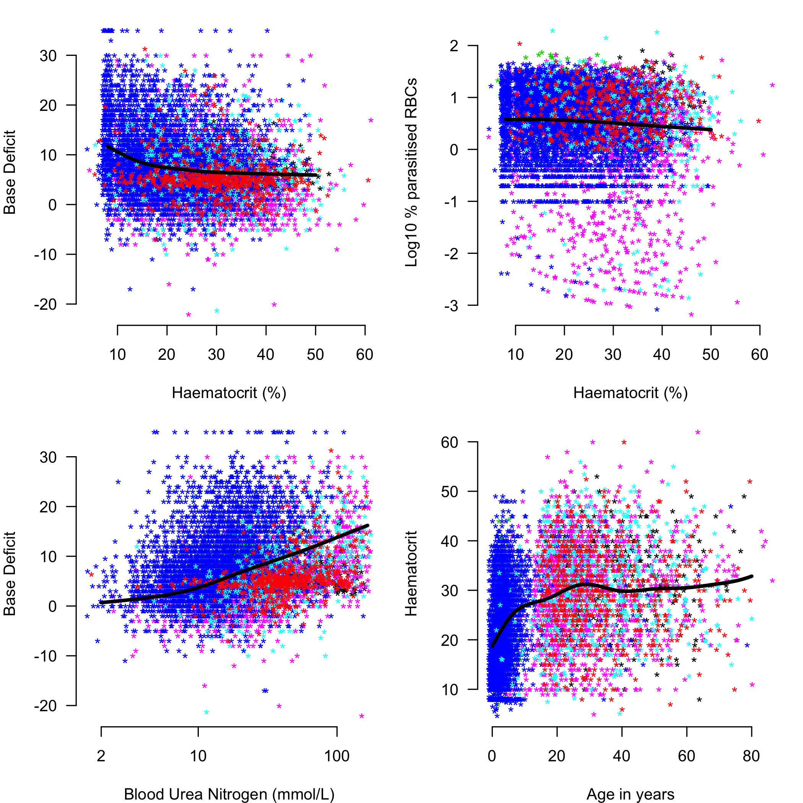
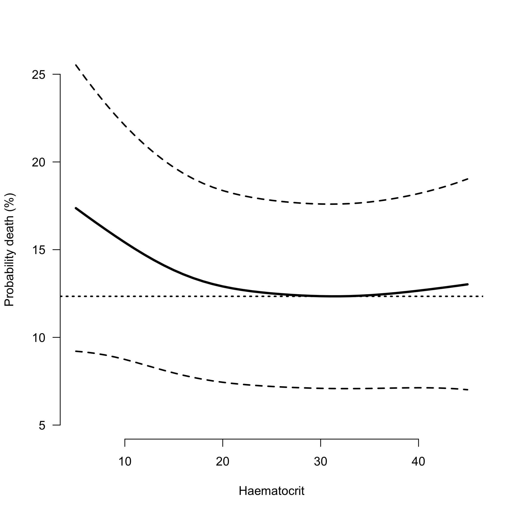
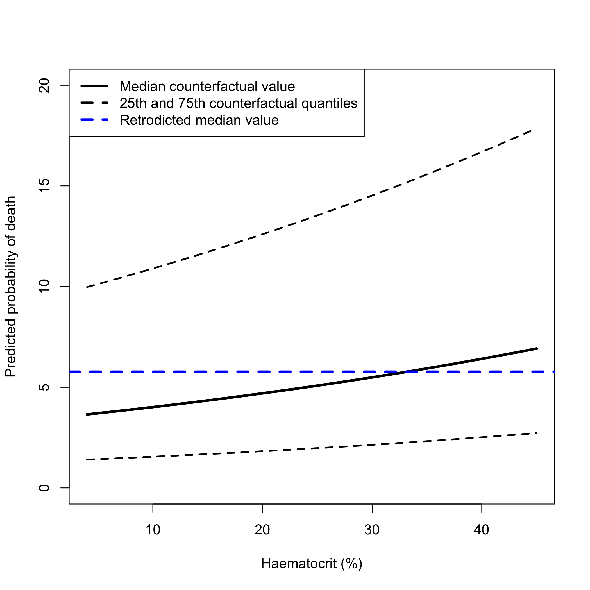
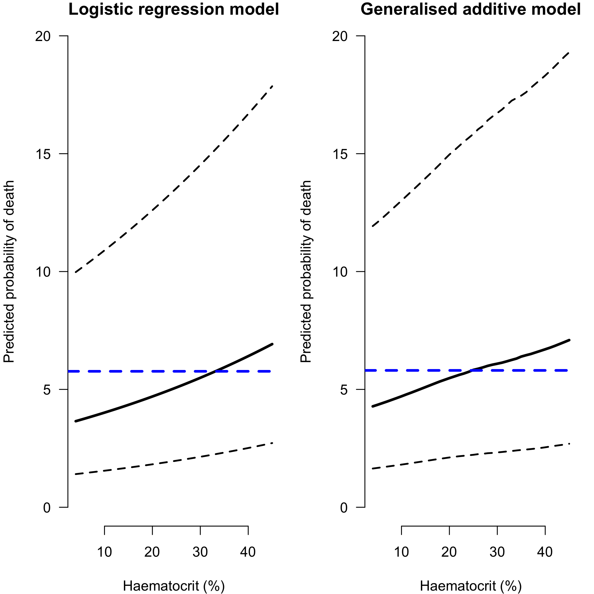

# Background

This looks at the severe malaria legacy dataset from MORU


# Imputation of missing variables

Quite a lot of the important covariates are missing in the older studies. We use linear regression to estimate these unknown variables. This section shows the results for single imputation - when fitting the final models we use multiple imputation.

* Mising base deficit is imputed using bicarbonate (if available) else using respiratory rate
* Missing Blood urea nitrogen is imputed using creatinine

Impute base deficit from bicarbonate

```r
BD_and_bicarbonate = !is.na(Leg_data$BD) & !is.na(Leg_data$bicarbonate)
print(paste('We have ', sum(BD_and_bicarbonate), 'observations for both bicarbonate and base deficit'))
```

```
## [1] "We have  5067 observations for both bicarbonate and base deficit"
```

```r
mod_impute1 = lmer(BD ~ bicarbonate + (1 | studyID) + (1 | country), data= Leg_data[BD_and_bicarbonate,])
missing_BD = is.na(Leg_data$BD)
Available_Bicarbonate = !is.na(Leg_data$bicarbonate)
print(paste(sum(missing_BD & Available_Bicarbonate), 'observations will now be imputed'))
```

```
## [1] "309 observations will now be imputed"
```

```r
# impute with model
Leg_data$BD[missing_BD & Available_Bicarbonate] = predict(mod_impute1,newdata=Leg_data[missing_BD & Available_Bicarbonate,], re.form=NA)
```

Impute base deficit from lactate

```r
BD_and_lactate = !is.na(Leg_data$BD) & !is.na(Leg_data$lactate)
print(paste('We have ', sum(BD_and_lactate), 'observations for both lactate and base deficit'))
```

```
## [1] "We have  632 observations for both lactate and base deficit"
```

```r
if(length(unique(Leg_data$studyID[BD_and_lactate]))==1){
  mod_impute2 = lm(BD ~ lactate, data= Leg_data[BD_and_lactate,])
} else {
  mod_impute2 = lmer(BD ~ lactate + (1 | studyID), data= Leg_data[BD_and_lactate,])
}
missing_BD = is.na(Leg_data$BD)
Available_Lactate = !is.na(Leg_data$lactate)
print(paste(sum(missing_BD & Available_Lactate), 'observations will now be imputed'))
```

```
## [1] "722 observations will now be imputed"
```

```r
# impute with model
Leg_data$BD[missing_BD & Available_Lactate] = predict(mod_impute2,newdata=Leg_data[missing_BD & Available_Lactate,], re.form=NA)
```

Impute base deficit from respiratory rate

```r
BD_and_rr = !is.na(Leg_data$BD) & !is.na(Leg_data$rr)
print(paste('We have ', sum(BD_and_rr), 'observations for both resp rate and base deficit'))
```

```
## [1] "We have  7572 observations for both resp rate and base deficit"
```

```r
mod_impute3 = lmer(BD ~ rr + (1 | studyID), data= Leg_data[BD_and_rr,])
missing_BD = is.na(Leg_data$BD)
Available_rr = !is.na(Leg_data$rr)
print(paste(sum(missing_BD & Available_rr), 'observations will now be imputed'))
```

```
## [1] "1650 observations will now be imputed"
```

```r
Leg_data$BD[missing_BD & Available_rr] = predict(mod_impute3,newdata=Leg_data[missing_BD & Available_rr,], re.form=NA)
```


Impute blood urea nitrogen from creatinine:

```r
BUN_and_cr = !is.na(Leg_data$BUN) & !is.na(Leg_data$creatinine)
print(paste('We have ', sum(BUN_and_cr), 'observations for both blood urea nitrogen and creatinine'))
```

```
## [1] "We have  1453 observations for both blood urea nitrogen and creatinine"
```

```r
mod_impute4 = lmer(BUN ~ creatinine + (1 | studyID), data= Leg_data[BUN_and_cr,])
missing_BUN = is.na(Leg_data$BUN)
Available_cr = !is.na(Leg_data$creatinine)
print(paste(sum(missing_BUN & Available_cr), 'observations will now be imputed'))
```

```
## [1] "679 observations will now be imputed"
```

```r
Leg_data$BUN[missing_BUN & Available_cr] = predict(mod_impute4,newdata=Leg_data[missing_BUN & Available_cr,], re.form=NA)
```

Resulting data we can now use:
The contributions of the different studies:

```r
vars_interest = c('outcome','HCT','LPAR_pct','BD','BUN','poedema',
                  'convulsions','coma','AgeInYear','drug_class')
complete_cases = apply(Leg_data[,vars_interest], 1, function(x) sum(is.na(x))) == 0
Complete_Leg_data = Leg_data[complete_cases,] # for the model fitting
Complete_Leg_data$studyID = as.factor(as.character(Complete_Leg_data$studyID))
# Whole dataset
table(Leg_data$studyID)
```

```
## 
##          AAV           AQ     AQGambia      AQUAMAT Core Malaria 
##          370          560          579         5494         1122 
##    SEAQUAMAT 
##         1461
```

```r
# in the complete dataset (all variables recorded)
table(Complete_Leg_data$studyID)
```

```
## 
##          AAV           AQ     AQGambia      AQUAMAT Core Malaria 
##          214          150          168         3666          657 
##    SEAQUAMAT 
##         1333
```

```r
Complete_Leg_data$drug_AS = 0
Complete_Leg_data$drug_AS[Complete_Leg_data$drug_class=='artemisinin']=1

# remove infinite log parasitaemias
ind_keep = !(is.infinite(Complete_Leg_data$LPAR_pct) | is.nan(Complete_Leg_data$LPAR_pct))
Complete_Leg_data = Complete_Leg_data[ind_keep,]
```

Data summaries

```r
Africa = c('The Gambia','Mozambique','Ghana','Kenya','Nigeria','Tanzania','Uganda','Rwanda','Congo')
Asia = c('Thailand','Vietnam','Bangladesh','Myanmar','India','Indonesia')
writeLines(paste('Children in Africa:',
                 sum(Complete_Leg_data$AgeInYear < 15 & Complete_Leg_data$country %in% Africa)))
```

```
## Children in Africa: 3779
```

```r
writeLines(paste('Adults in Africa:',
                 sum(Complete_Leg_data$AgeInYear >= 15 & Complete_Leg_data$country %in% Africa)))
```

```
## Adults in Africa: 44
```

```r
writeLines(paste('Children in Asia:',
                 sum(Complete_Leg_data$AgeInYear < 15 & Complete_Leg_data$country %in% Asia)))
```

```
## Children in Asia: 198
```

```r
writeLines(paste('Adults in Asia:',
                 sum(Complete_Leg_data$AgeInYear >= 15 & Complete_Leg_data$country %in% Asia)))
```

```
## Adults in Asia: 2095
```

# Exploratory analysis

First we look at the mortality rates across the different studies (only in the Complete_Leg_data, so they won't exactly match the reported fatality rates in the respective papers). This is maling a key assumption that data are missing at random...


```
## [1] "Core Malaria , mortality of: 23 %"
## [1] "AQGambia , mortality of: 12 %"
## [1] "AAV , mortality of: 12 %"
## [1] "SEAQUAMAT , mortality of: 18 %"
## [1] "AQUAMAT , mortality of: 9 %"
## [1] "AQ , mortality of: 23 %"
```

We look at the quantiles of the ages in the different studies:

```
## [1] "Core Malaria, ages:1 Core Malaria, ages:27 Core Malaria, ages:75"
## [1] "AQGambia, ages:1 AQGambia, ages:4 AQGambia, ages:9"
## [1] "AAV, ages:15 AAV, ages:34 AAV, ages:77"
## [1] "SEAQUAMAT, ages:2 SEAQUAMAT, ages:25 SEAQUAMAT, ages:87"
## [1] "AQUAMAT, ages:0 AQUAMAT, ages:2 AQUAMAT, ages:78"
## [1] "AQ, ages:15 AQ, ages:30 AQ, ages:74"
```

```
## [1] "Core Malaria"
## 
##  Amodiaquine   Artemether   Artesunate  Chloroquine Lumefantrine 
##            0           11          368            2            0 
##   Mefloquine          NAC      Quinine 
##            7            6          262 
## [1] "AQGambia"
## 
##  Amodiaquine   Artemether   Artesunate  Chloroquine Lumefantrine 
##            0           82            0            0            0 
##   Mefloquine          NAC      Quinine 
##            0            0           86 
## [1] "AAV"
## 
##  Amodiaquine   Artemether   Artesunate  Chloroquine Lumefantrine 
##            0          102          112            0            0 
##   Mefloquine          NAC      Quinine 
##            0            0            0 
## [1] "SEAQUAMAT"
## 
##  Amodiaquine   Artemether   Artesunate  Chloroquine Lumefantrine 
##            0            0          645            0            0 
##   Mefloquine          NAC      Quinine 
##            0            0          628 
## [1] "AQUAMAT"
## 
##  Amodiaquine   Artemether   Artesunate  Chloroquine Lumefantrine 
##            0            0         1837            0            0 
##   Mefloquine          NAC      Quinine 
##            0            0         1818 
## [1] "AQ"
## 
##  Amodiaquine   Artemether   Artesunate  Chloroquine Lumefantrine 
##            0           73            0            0            0 
##   Mefloquine          NAC      Quinine 
##            0            0           77
```


Let's look at the linear associations between the key baseline variables. We use mixed effects linear models to estimate these associations (random effect terms for both country and study).


```
## 
## Family: gaussian 
## Link function: identity 
## 
## Formula:
## BD ~ s(HCT) + s(studyID, bs = "re") + s(country, bs = "re")
## 
## Parametric coefficients:
##             Estimate Std. Error t value Pr(>|t|)    
## (Intercept)   7.5393     0.6708   11.24   <2e-16 ***
## ---
## Signif. codes:  0 '***' 0.001 '**' 0.01 '*' 0.05 '.' 0.1 ' ' 1
## 
## Approximate significance of smooth terms:
##               edf Ref.df      F  p-value    
## s(HCT)      5.015  6.114  45.51  < 2e-16 ***
## s(studyID)  3.104  5.000 296.05 6.14e-05 ***
## s(country) 12.773 14.000  36.15  0.00195 ** 
## ---
## Signif. codes:  0 '***' 0.001 '**' 0.01 '*' 0.05 '.' 0.1 ' ' 1
## 
## R-sq.(adj) =  0.143   Deviance explained = 14.5%
## GCV =  41.46  Scale est. = 41.312    n = 6116
```

```
## 
## Family: gaussian 
## Link function: identity 
## 
## Formula:
## LPAR_pct ~ s(HCT) + s(studyID, bs = "re") + s(country, bs = "re")
## 
## Parametric coefficients:
##             Estimate Std. Error t value Pr(>|t|)    
## (Intercept)   0.5303     0.0836   6.344  2.4e-10 ***
## ---
## Signif. codes:  0 '***' 0.001 '**' 0.01 '*' 0.05 '.' 0.1 ' ' 1
## 
## Approximate significance of smooth terms:
##              edf Ref.df       F  p-value    
## s(HCT)     2.159  2.739   7.619 0.000159 ***
## s(studyID) 4.405  5.000 420.823  < 2e-16 ***
## s(country) 9.881 14.000  14.595 0.022998 *  
## ---
## Signif. codes:  0 '***' 0.001 '**' 0.01 '*' 0.05 '.' 0.1 ' ' 1
## 
## R-sq.(adj) =  0.102   Deviance explained = 10.4%
## GCV = 0.55697  Scale est. = 0.55538   n = 6116
```

```
## 
## Family: gaussian 
## Link function: identity 
## 
## Formula:
## BD ~ s(log10(BUN)) + s(studyID, bs = "re") + s(country, bs = "re")
## 
## Parametric coefficients:
##             Estimate Std. Error t value Pr(>|t|)    
## (Intercept)    6.658      0.664   10.03   <2e-16 ***
## ---
## Signif. codes:  0 '***' 0.001 '**' 0.01 '*' 0.05 '.' 0.1 ' ' 1
## 
## Approximate significance of smooth terms:
##                  edf Ref.df     F  p-value    
## s(log10(BUN))  4.417  5.452 249.3  < 2e-16 ***
## s(studyID)     2.399  5.000 393.8 2.16e-11 ***
## s(country)    13.364 14.000 181.8  < 2e-16 ***
## ---
## Signif. codes:  0 '***' 0.001 '**' 0.01 '*' 0.05 '.' 0.1 ' ' 1
## 
## R-sq.(adj) =  0.268   Deviance explained = 27.1%
## GCV = 35.373  Scale est. = 35.25     n = 6116
```

```
## 
## Family: gaussian 
## Link function: identity 
## 
## Formula:
## HCT ~ s(AgeInYear) + s(studyID, bs = "re") + s(country, bs = "re")
## 
## Parametric coefficients:
##             Estimate Std. Error t value Pr(>|t|)    
## (Intercept)    24.78       1.03   24.06   <2e-16 ***
## ---
## Signif. codes:  0 '***' 0.001 '**' 0.01 '*' 0.05 '.' 0.1 ' ' 1
## 
## Approximate significance of smooth terms:
##                 edf Ref.df      F  p-value    
## s(AgeInYear)  7.426   8.27  44.50  < 2e-16 ***
## s(studyID)    3.312   5.00  63.71   0.0638 .  
## s(country)   12.798  14.00 153.55 4.72e-11 ***
## ---
## Signif. codes:  0 '***' 0.001 '**' 0.01 '*' 0.05 '.' 0.1 ' ' 1
## 
## R-sq.(adj) =  0.303   Deviance explained = 30.5%
## GCV = 68.852  Scale est. = 68.575    n = 6116
```

<!-- -->


Now one of the important plots: the un-adjusted association between haematocrit at baseline and death.
This is known as the U curve, and we can see this U association (again I'm adjusting for country and study).
Fitting a GAM here as we know the association is not linear in HCT (previously reported as U-shaped).


```r
par(las=1, bty='n')
Complete_Leg_data$country=as.factor(Complete_Leg_data$country)
modHCT=gam(outcome ~ s(HCT) + s(studyID, bs='re') + s(country, bs='re'),
           data = Complete_Leg_data, family='binomial')
summary(modHCT)
```

```
## 
## Family: binomial 
## Link function: logit 
## 
## Formula:
## outcome ~ s(HCT) + s(studyID, bs = "re") + s(country, bs = "re")
## 
## Parametric coefficients:
##             Estimate Std. Error z value Pr(>|z|)    
## (Intercept)  -1.8865     0.2397   -7.87 3.54e-15 ***
## ---
## Signif. codes:  0 '***' 0.001 '**' 0.01 '*' 0.05 '.' 0.1 ' ' 1
## 
## Approximate significance of smooth terms:
##               edf Ref.df  Chi.sq p-value   
## s(HCT)      2.304  2.922   5.482 0.15478   
## s(studyID)  3.611  5.000 314.182 0.00361 **
## s(country) 10.766 14.000 162.027 0.01464 * 
## ---
## Signif. codes:  0 '***' 0.001 '**' 0.01 '*' 0.05 '.' 0.1 ' ' 1
## 
## R-sq.(adj) =  0.0484   Deviance explained = 5.99%
## UBRE = -0.25846  Scale est. = 1         n = 6116
```

```r
preds = predict(modHCT, newdata = data.frame(HCT=5:45, studyID='AQ', country='Thailand', country=1), 
                exclude = c("s(country)","s(studyID)"), type='response', se.fit=T)
plot(5:45, 100*preds$fit, ylab='Probability death (%)', xlab='Haematocrit', 
     type='l', lwd=3,ylim = c(5,25))
lines(5:45, 100*preds$fit + 100*2*preds$se.fit, lty=2,lwd=2)
lines(5:45, 100*preds$fit - 100*2*preds$se.fit,lty=2,lwd=2)
abline(h = min(100*preds$fit), lwd=2, lty=3)
```

<!-- -->


# Predictive value of anaemia on death adjusting for confounders

This section now looks at the estimated causal effect of anaemia on outcome, if we assume that the posited DAG is correct. We fit both linear and non-linear models to estimate this effect.

Before fitting the more complex GAM models we explore the standard glm (logistic regression) models.


```r
mod_full_GLM = glmer(outcome ~ HCT + LPAR_pct + AgeInYear + coma + convulsions +
                       poedema + log10(BUN) + BD + drug_AS + 
                       (1 | studyID) + (1 | country),
                     data = Complete_Leg_data, family=binomial)
```

```
## Warning in checkConv(attr(opt, "derivs"), opt$par, ctrl =
## control$checkConv, : Model failed to converge with max|grad| = 0.00101495
## (tol = 0.001, component 1)
```

```r
summary(mod_full_GLM)
```

```
## Generalized linear mixed model fit by maximum likelihood (Laplace
##   Approximation) [glmerMod]
##  Family: binomial  ( logit )
## Formula: 
## outcome ~ HCT + LPAR_pct + AgeInYear + coma + convulsions + poedema +  
##     log10(BUN) + BD + drug_AS + (1 | studyID) + (1 | country)
##    Data: Complete_Leg_data
## 
##      AIC      BIC   logLik deviance df.resid 
##   3459.7   3540.3  -1717.8   3435.7     6104 
## 
## Scaled residuals: 
##     Min      1Q  Median      3Q     Max 
## -3.9034 -0.3324 -0.1914 -0.1076 15.4072 
## 
## Random effects:
##  Groups  Name        Variance  Std.Dev. 
##  country (Intercept) 1.501e-01 3.875e-01
##  studyID (Intercept) 1.919e-09 4.381e-05
## Number of obs: 6116, groups:  country, 15; studyID, 6
## 
## Fixed effects:
##               Estimate Std. Error z value Pr(>|z|)    
## (Intercept)  -7.000057   0.306929 -22.807  < 2e-16 ***
## HCT           0.016441   0.005284   3.111 0.001863 ** 
## LPAR_pct     -0.001281   0.060471  -0.021 0.983095    
## AgeInYear     0.013715   0.003840   3.571 0.000355 ***
## coma          1.338046   0.100906  13.260  < 2e-16 ***
## convulsions1  0.513532   0.116864   4.394 1.11e-05 ***
## poedema1      0.543720   0.385373   1.411 0.158276    
## log10(BUN)    1.778368   0.166012  10.712  < 2e-16 ***
## BD            0.121719   0.007183  16.944  < 2e-16 ***
## drug_AS      -0.343604   0.090337  -3.804 0.000143 ***
## ---
## Signif. codes:  0 '***' 0.001 '**' 0.01 '*' 0.05 '.' 0.1 ' ' 1
## 
## Correlation of Fixed Effects:
##             (Intr) HCT    LPAR_p AgInYr coma   cnvls1 poedm1 l10(BU BD    
## HCT         -0.483                                                        
## LPAR_pct    -0.041  0.030                                                 
## AgeInYear    0.039 -0.178  0.001                                          
## coma        -0.163 -0.027  0.075  0.000                                   
## convulsins1 -0.133 -0.073  0.017  0.108 -0.220                            
## poedema1    -0.004 -0.005 -0.006 -0.048  0.027  0.000                     
## log10(BUN)  -0.700  0.064 -0.047 -0.245 -0.014  0.103  0.006              
## BD          -0.148  0.199 -0.180  0.135 -0.024  0.024 -0.008 -0.262       
## drug_AS     -0.091 -0.012 -0.024 -0.022  0.007  0.004 -0.025 -0.044 -0.020
## convergence code: 0
## Model failed to converge with max|grad| = 0.00101495 (tol = 0.001, component 1)
```

Now let's make counterfactual retrodictions of anaemia on death for the patients in the database.


```r
myquantiles = c(0.25,0.5,0.75) # this is 50% predictive interval

overall_median_mortality = median(100*predict(mod_full_GLM, type='response'))
par(las=1, bty='n')
x_hcts = seq(4,45, by=1)
probs_lin = array(dim = c(3, length(x_hcts)))
for(i in 1:length(x_hcts)){
  mydata = Complete_Leg_data
  mydata$HCT=x_hcts[i]
  ys = 100*predict(mod_full_GLM, newdata = mydata, re.form=NA, type='response')
  probs_lin[,i] = quantile(ys, probs=myquantiles)
}
```

The way to interpret this `counterfactual' plot is as follows: suppose that every individual in the dataset was assigned (as in a intervention) a specific haematocrit $X$, what would the resulting per patient probability of death be. Here we summarise these probabilities by the predicted mean probability of death and 80\% predictive intervals.

<!-- -->


## More complex GAM model

The GAM model allows for non-linear relationships between certain variables and the outcome.

Here we fit as non-linear the effect of age and haematocrit on mortality.
We add a random effect term for the studyID and a random effect term for the country.
This should be adjusting for a confounder of quality of care (which potentially impacts both general anaemia and outcome in study).


```r
mod_full_GAM = gam(outcome ~ s(HCT,AgeInYear) + LPAR_pct  + coma + convulsions +
                     poedema + log10(BUN) + BD + drug_AS + 
                     s(studyID, bs='re') + s(country, bs='re'),
                   data=Complete_Leg_data, family=binomial)
summary(mod_full_GAM)
```

```
## 
## Family: binomial 
## Link function: logit 
## 
## Formula:
## outcome ~ s(HCT, AgeInYear) + LPAR_pct + coma + convulsions + 
##     poedema + log10(BUN) + BD + drug_AS + s(studyID, bs = "re") + 
##     s(country, bs = "re")
## 
## Parametric coefficients:
##               Estimate Std. Error z value Pr(>|z|)    
## (Intercept)  -6.327596   0.270364 -23.404  < 2e-16 ***
## LPAR_pct      0.001766   0.060455   0.029 0.976696    
## coma          1.330827   0.100888  13.191  < 2e-16 ***
## convulsions1  0.534704   0.117346   4.557  5.2e-06 ***
## poedema1      0.547871   0.384139   1.426 0.153801    
## log10(BUN)    1.701401   0.170552   9.976  < 2e-16 ***
## BD            0.123330   0.007331  16.824  < 2e-16 ***
## drug_AS      -0.343908   0.090360  -3.806 0.000141 ***
## ---
## Signif. codes:  0 '***' 0.001 '**' 0.01 '*' 0.05 '.' 0.1 ' ' 1
## 
## Approximate significance of smooth terms:
##                       edf Ref.df Chi.sq  p-value    
## s(HCT,AgeInYear) 5.487067  7.664 33.634 3.60e-05 ***
## s(studyID)       0.004292  5.000  0.003    0.496    
## s(country)       9.942725 14.000 74.592 2.79e-15 ***
## ---
## Signif. codes:  0 '***' 0.001 '**' 0.01 '*' 0.05 '.' 0.1 ' ' 1
## 
## R-sq.(adj) =   0.27   Deviance explained = 29.1%
## UBRE = -0.43785  Scale est. = 1         n = 6116
```


Now we compute the corresponding counterfactual probabilities of death for the dataset for all values of the haematocrit:


```r
overall_median_mortalityGAM = median(100*predict(mod_full_GAM, type='response'))
par(las=1, bty='n')
probs_gam = array(dim = c(3, length(x_hcts)))
for(i in 1:length(x_hcts)){
  mydata = Complete_Leg_data
  mydata$HCT=x_hcts[i]
  ys = 100*predict(mod_full_GAM, newdata = mydata, type='response')
  probs_gam[,i] = quantile(ys, probs=myquantiles)
}
```

We see that the effect of haematocrit on mortality is non-linear under this model: below 20 is protective, above 20 plateaus out:


```r
#
par(las=1, mfrow=c(1,2), bty='n', mar=c(4,4,1,1))
### Plot the standard logistic regression model
plot(x_hcts,probs_lin[2,], xlim=c(4,45), ylab='Predicted probability of death', 
     xlab='Haematocrit (%)', ylim=c(0,20), lty=1, lwd=3, type='l')
lines(x_hcts, probs_lin[1,], lty=2, lwd=2)
lines(x_hcts, probs_lin[3,], lty=2, lwd=2)
abline(h=overall_median_mortality, lwd=3, col='blue',lty=2)
title('Logistic regression model')
### And now the GAM model
plot(x_hcts,probs_gam[2,], xlim=c(4,45), ylab='Predicted probability of death', 
     xlab='Haematocrit (%)', ylim=c(0,20), lty=1, lwd=3, type='l')
lines(x_hcts, probs_gam[1,], lty=2, lwd=2)
lines(x_hcts, probs_gam[3,], lty=2, lwd=2)
abline(h=overall_median_mortalityGAM, lwd=3, col='blue',lty=2)
title('Generalised additive model')
```

<!-- -->


## Model comparison

Which model is better fit in terms of AIC


```r
print(AIC(mod_full_GAM, mod_full_GLM))
```

```
##                    df      AIC
## mod_full_GAM 23.43408 3438.101
## mod_full_GLM 12.00000 3459.687
```

And in terms of deviance


```r
print(list(mod_full_GLM = deviance(mod_full_GLM), mod_full_GAM=deviance(mod_full_GAM)))
```

```
## $mod_full_GLM
## [1] 3400.304
## 
## $mod_full_GAM
## [1] 3391.233
```

