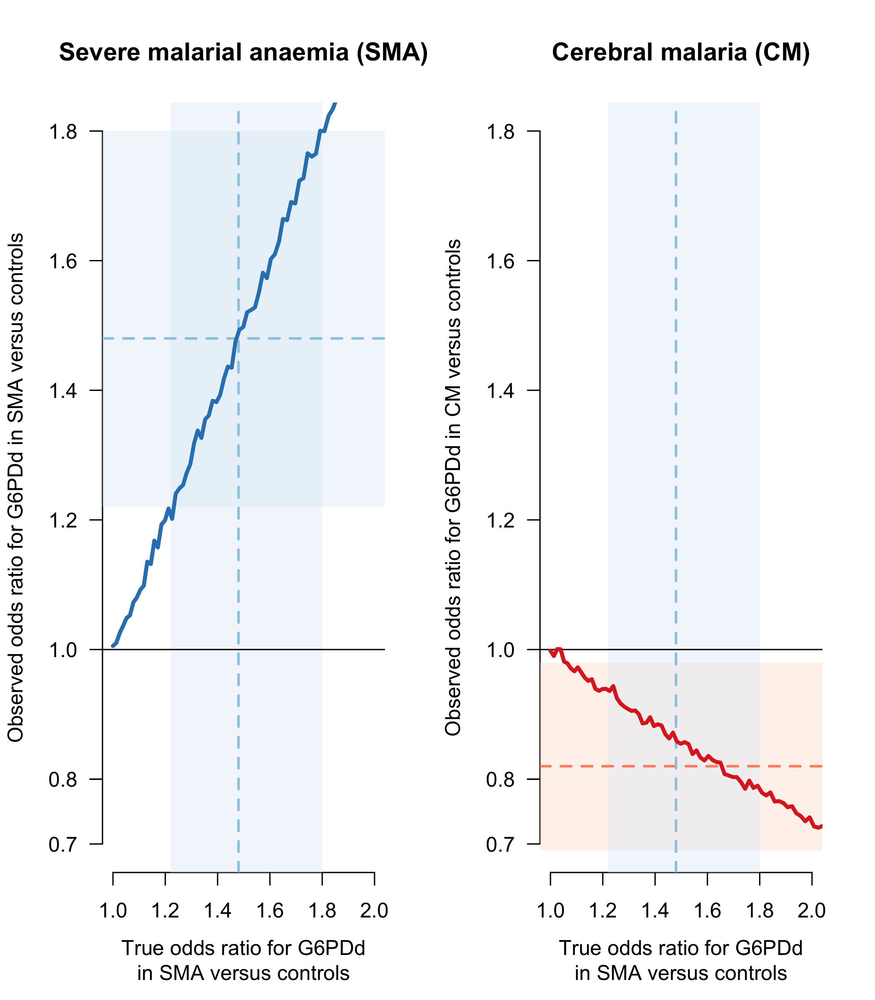

```r
require(RColorBrewer)
RUN_SIM = T
```

# Outline

This code goes through some very simple simulations that demonstrate selection bias in a severe malaria type study.

The idea is to see whether the type of results reported in Clarke et al (2017), whereby they see less coma in G6PD deficients and more anaemia in G6PD deficients, can be reproduced with an extremely simple simulation model that accounts for selection (collider) bias inherent in severe malaria studies.

Reminder on the methodology in the Clarke study: They have about 11000 patients from severe malaria studies (already selection bias here). They then compare G6PD allele frequencies between controls and 

* Patients who have cerebral malaria
* Patients who have severe malarial anaemia

The key point is that in the two groups, patients with both are discarded.

# Base model

Let us suppose there are three variables: G6PD status (normal or deficient); Anaemia (yes/no); Coma (yes/no).
Let's assume that G6PD deficiency increases the probability of anaemia. 
In this simple model, let's assume the null hypothesis that coma and G6PD status are independent.
Let's also assume that we are only dealing with males, so no complications in the model due to heterozygote women. This implies we don't need to make assumptions about a gene dose effect.

Therefore to summarise: the only assumption is that G6PD deficiency increases your risk of anaemia, this is parametrised by $\pi$. We assume that G6PD status does not change your risk of coma.


# Simulation


We run the model for values of $\pi$ from $\pi=$P_anaemia up to 0.5. This is converted into odds ratio for G6PDd in the SMA group.


```r
if(RUN_SIM){
  # The number of malaria patients
  N = 10^6
  P_coma = 0.34
  P_anaemia = 0.24
  P_G6PDdef = 0.15
  
  PIs = seq(P_anaemia, 0.5, length.out = 100)
  ORcoma = ORanaemia = array(dim=length(PIs))
  TrueOR_anaemia = array(dim=length(PIs))
  
  # odds of G6PDd in controls
  O1 = P_G6PDdef/(1-P_G6PDdef)
  
  for(i in 1:length(PIs)){
    
    # The Probability of being anaemic if you are G6PD deficient
    P_anaemia_def = PIs[i] 
    
    # We solve the equation to work out the Probability of being anaemic if you are G6PD normal
    # This is dependent on the previous probabilities (simple algebra)
    P_anaemia_norm = (P_anaemia - P_G6PDdef*P_anaemia_def)/(1-P_G6PDdef)
    
    # We assume that G6PD status and Coma status are independent
    G6PDstatus = sample(c('Normal','Def'), size = N, replace = T, 
                        prob = c(1-P_G6PDdef, P_G6PDdef))
    Comastatus = sample(c('No Coma','Coma'), size = N, replace = T, 
                        prob = c(1-P_coma, P_coma))
    # Generate anaemia status dependent on G6PD status
    Anaemiastatus = array(dim = N)
    normals = G6PDstatus=='Normal'
    defs = !normals
    Anaemiastatus[normals] = sample(x = c('No Anaemia','Anaemia'), 
                                    size = sum(normals), 
                                    replace = T, 
                                    prob = c(1-P_anaemia_norm,P_anaemia_norm))
    Anaemiastatus[defs] = sample(x = c('No Anaemia','Anaemia'), 
                                 size = sum(defs),
                                 replace = T, 
                                 prob = c(1-P_anaemia_def,P_anaemia_def))
    
    Study_dat = data.frame(Coma = Comastatus,
                           G6PD = G6PDstatus,
                           Anaemia = Anaemiastatus)
    
    P_G6PDd_Anaemia = PIs[i]*P_G6PDdef/P_anaemia
    TrueOR_anaemia[i] =  P_G6PDd_Anaemia/(1-P_G6PDd_Anaemia)/O1
    # now subselect only those without both
    study_patients = xor(Comastatus=='Coma' , Anaemiastatus == 'Anaemia')
    
    Study_dat = Study_dat[study_patients,]
    
    # odds of G6PDd in cerebral malaria group
    O2 = (sum(Study_dat$Coma=='Coma' & Study_dat$G6PD=='Def')/
            sum(Study_dat$Coma=='Coma' & Study_dat$G6PD=='Normal'))
    
    # odds ratio for G6PDd between cases and controls
    ORcoma[i] = O2/O1
    
    
    # odds of G6PDd in SMA group
    O2 = sum(Study_dat$Anaemia=='Anaemia' & Study_dat$G6PD=='Def')/
      sum(Study_dat$Anaemia=='Anaemia' & Study_dat$G6PD=='Normal')
    # odds ratio for G6PDd between cases and controls: SMA
    ORanaemia[i] = O2/O1
    
    
  }
  Results = list(ORanaemia=ORanaemia,
                 ORcoma=ORcoma,
                 TrueOR_anaemia=TrueOR_anaemia)
  save(Results, file = 'SimResults.RData')
} else {
  load('SimResults.RData')
}
```


The following plot shows how varying the odds ratio for anaemia changes the observed odds ratio for coma:

<!-- -->


```r
ind = which.min(abs(Results$TrueOR_anaemia-1.48))
writeLines(sprintf('If we take the reported OR of 1.48 for G6PDd in SMA cases versus controls, then the model estimate for the OR for G6PDd in CM cases versus controls is %s. Clarke et al report 0.82', round(Results$ORcoma[ind],2)))
```

```
## If we take the reported OR of 1.48 for G6PDd in SMA cases versus controls, then the model estimate for the OR for G6PDd in CM cases versus controls is 0.86. Clarke et al report 0.82
```

